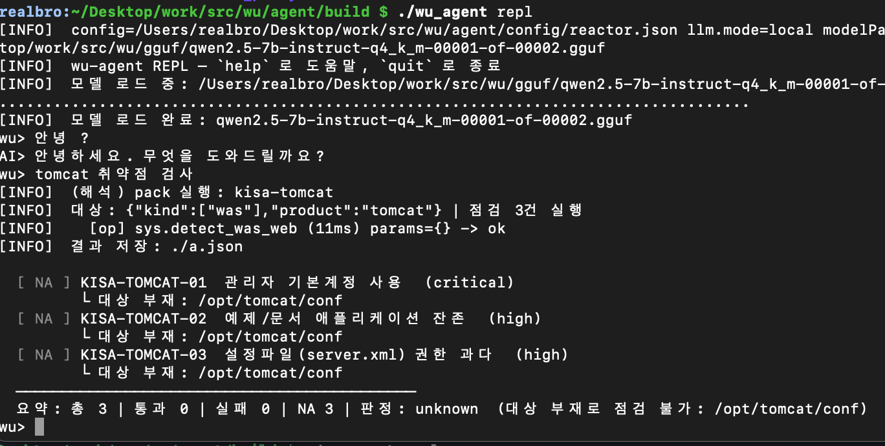

# secu_ai_agent (wu)

온디바이스 AI 보안 점검 에이전트. 자연어 → Check Pack / ReAct(op) 실행 → 콘솔·`a.json` 결과.

저장소: [realbrotha/secu_ai_agent](https://github.com/realbrotha/secu_ai_agent)  
설계 원본: [`plan/final_plan.md`](plan/final_plan.md)

## 실행 화면



`./wu_agent repl` → 모델 선로드 → 자연어로 `kisa-tomcat` 실행 (대상 경로 없으면 NA).

## 구성

| 경로 | 설명 |
|------|------|
| `agent/` | C++17 에이전트 (빌드·실행·CLI) |
| `agent/third_party/` | 벤더링 (llama.cpp, replxx, nlohmann/json) |
| `gguf/` | GGUF 모델 (git 제외, 로컬 다운로드) |
| `plan/final_plan.md` | 설계·로드맵·검증 로그 |

---

## Quick start

```bash
# 1) 모델 (7B Q4_K_M, 2분할)
cd gguf
for i in 00001 00002; do
  curl -L -C - -o "qwen2.5-7b-instruct-q4_k_m-${i}-of-00002.gguf" \
    "https://huggingface.co/Qwen/Qwen2.5-7B-Instruct-GGUF/resolve/main/qwen2.5-7b-instruct-q4_k_m-${i}-of-00002.gguf"
done

# 2) 빌드 (CMake ≥ 3.14, C++17 — 첫 빌드는 llama.cpp 포함으로 수 분)
cd ../agent
cmake -S . -B build -DCMAKE_BUILD_TYPE=Release -DCMAKE_EXPORT_COMPILE_COMMANDS=ON
cmake --build build -j

# 3) 실행 (cwd는 agent/ 권장)
./build/wu_agent repl
./build/wu_agent run kisa-tomcat --var was.home=$PWD/testdata/tomcat-vuln
./build/wu_agent llm "안녕"
```

---

## 빌드

```bash
cd agent
cmake -S . -B build -DCMAKE_BUILD_TYPE=Release -DCMAKE_EXPORT_COMPILE_COMMANDS=ON
cmake --build build -j
```

- `third_party/llama.cpp` 없으면 LLM stub로 빌드 (`WU_HAVE_LLAMA` 없음)
- `third_party/replxx` 있으면 TTY REPL line edit (`WU_HAVE_REPLXX`)

### CMake 연동 요약

- llama.cpp: 정적 링크, METAL/NATIVE off, tests/examples/server/tools off
- replxx: TTY면 replxx, 파이프/non-TTY면 `getline` 폴백

---

## 설정

[`agent/config/config.json`](agent/config/config.json)

| 키 | 의미 |
|----|------|
| `llm.mode` | `local` \| `off` \| `remote`(미구현) |
| `llm.modelPath` | GGUF 경로. 상대경로는 **agent 루트** 기준 (`../gguf/...`) |
| `policy.enableLlmReasoning` | explain/ask/agent/자연어 LLM 게이트 |
| `rulesDir` | 탐지 룰 JSON 디렉터리 (`config/rules`) |
| `policy.readAllowlist` | PathGuard 허용 루트 |

`-c` / `--config`로 설정 지정. cwd가 `agent/`가 아니어도 실행파일 상위에서 `config/config.json`을 탐색한다.

---

## 실행

`agent/`에서 실행하는 것을 권장.

```bash
# 대화형 (시작 시 모델 선로드)
./build/wu_agent repl

# 결정적 pack
./build/wu_agent run kisa-tomcat --var was.home=$PWD/testdata/tomcat-vuln
./build/wu_agent run kisa-apache --var web.root=$PWD/testdata/apache-vuln

# op 직접
./build/wu_agent ops
./build/wu_agent op net.list_ports '{"proto":"tcp","state":"listen"}'

# LLM 단발 / ReAct
./build/wu_agent llm "안녕"
./build/wu_agent agent "리스닝 중인 TCP 포트 몇 개인지 확인해줘"

# 다른 cwd
./build/wu_agent -c /path/to/agent/config/config.json rules
```

결과: 콘솔 표 + `./a.json`  
llama 상세 로그: 기본 숨김. 필요 시 `WU_LLAMA_VERBOSE=1`.

### REPL 명령

| 명령 | 설명 |
|------|------|
| `list rules` / `ops` | 탐지 룰·op 목록 |
| `run <packId> [--var k=v]` | pack 실행 |
| `show <checkId>` | 직전 결과 항목 |
| `explain` / `ask <질문>` | AI 요약·질의 |
| `agent <목표>` | 다단계 ReAct |
| 자연어 | pack 라우팅 또는 일반 대화 |
| `quit` | 종료 |

---

## 모델 (gguf/)

대용량이라 **git에 포함하지 않는다** (`.gitignore`).  
`llm.modelPath` 예: `../gguf/qwen2.5-7b-instruct-q4_k_m-00001-of-00002.gguf`  
→ agent 루트 기준 → `gguf/` 파일.

### 7B (활성 기본, Q4_K_M · 2분할)

```bash
cd gguf
for i in 00001 00002; do
  curl -L -C - -o "qwen2.5-7b-instruct-q4_k_m-${i}-of-00002.gguf" \
    "https://huggingface.co/Qwen/Qwen2.5-7B-Instruct-GGUF/resolve/main/qwen2.5-7b-instruct-q4_k_m-${i}-of-00002.gguf"
done
```

첫 shard만 `modelPath`에 넣으면 llama.cpp가 나머지 자동 로드.

### 1.5B (fallback)

```bash
curl -L -C - -o qwen2.5-1.5b-instruct-q4_k_m.gguf \
  "https://huggingface.co/Qwen/Qwen2.5-1.5B-Instruct-GGUF/resolve/main/qwen2.5-1.5b-instruct-q4_k_m.gguf"
```

`config.json`의 `modelPath`만 바꾸면 스왑.

라이선스: Qwen2.5 **0.5B/1.5B/7B/14B = Apache-2.0**. **3B·72B 비상업 → 미사용.**

---

## 벤더링 (agent/third_party/)

소스/정적 커밋 (**submodule 아님**). 업데이트는 다시 받아 교체 후 커밋만.  
업스트림 내부 README(`llama.cpp/README.md` 등)는 벤더 원본이며, 에이전트 연동 정보는 **이 루트 README**가 기준.

| lib | 버전/태그 | 출처 | 획득일 | 비고 |
|-----|-----------|------|--------|------|
| llama.cpp / ggml | commit `2969d6d` (ggml 0.16.0) | https://github.com/ggml-org/llama.cpp | 2026-07-14 | Phase 1, CPU-only |
| nlohmann/json | v3.11.3 | https://github.com/nlohmann/json | 2026-07-14 | `nlohmann/json.hpp` |
| replxx | release-0.0.4 (`2b24846`) | https://github.com/AmokHuginnsson/replxx | 2026-07-15 | REPL 라인 편집 |
| curl | (미정) | https://github.com/curl/curl | - | Phase 2 |
| openssl | (미정) | https://github.com/openssl/openssl | - | Phase 3 |

### 도입 절차

1. `git clone --branch <tag> <url>` (또는 commit checkout)
2. `rm -rf .git`
3. `agent/third_party/<lib>/` 로 복사
4. 위 표 갱신 후 커밋

### 라이선스 집계

- llama.cpp / ggml: MIT
- replxx: BSD-3-Clause
- nlohmann/json: MIT
- curl / openssl: 도입 시 각각 curl License / Apache-2.0

---

## agent 구조

```
agent/src/main.cpp          CLI / REPL / config 해석
agent/src/op/               op 프레임워크 + native op
agent/src/core/             pack 인터프리터, ReAct
agent/src/llm/              LocalLlamaEngine
agent/src/platform/         OS별 net/proc
agent/config/config.json   설정
agent/config/rules/         탐지 룰 (kisa-tomcat, kisa-apache 등)
agent/third_party/          벤더링
gguf/                       모델 (git 미포함)
```

## 로드맵

| Phase | 상태 | 내용 |
|-------|------|------|
| 0 | ✅ | 스캐폴드·CMake |
| 3 | ✅ | op 프레임워크·native op |
| S | ✅ | pack 인터프리터·REPL·a.json |
| 1 | ✅ | llama.cpp 벤더링·LocalLlamaEngine |
| 4 | ✅ | 라우팅·요약·ask·ReAct |
| 2/5 | ⬜ | remote LLM·서버 API |
| 6 | ⬜ | 패키징·서비스 |
