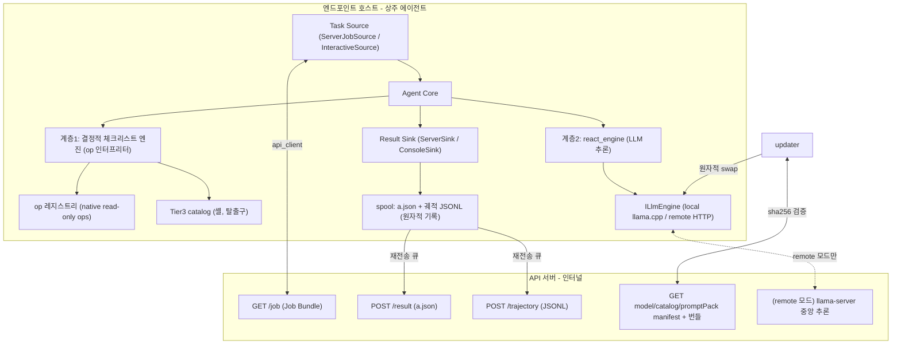
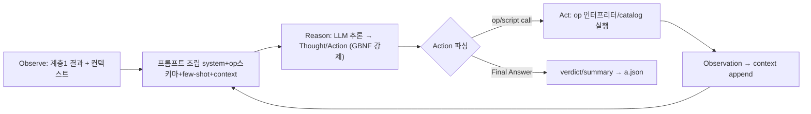

# AI 보안 에이전트 (wu) — 최종 통합 플랜

> 본 문서는 `plan.md`(기반)와 `plan.dispatch-wasweb.md`(정밀 보강, §0~§12)를 **하나로 종합한 최종본**이다.
> 이후 이 문서를 단일 진실원천(single source of truth)으로 삼는다. 두 원본은 이력 참고용으로 보존.

## 목차
1. [개념 정립 — 무엇을 만드는가](#1-개념-정립--무엇을-만드는가)
2. [전제 / 핵심 결정](#2-전제--핵심-결정)
3. [안전성 원칙 (항상 우선)](#3-안전성-원칙-항상-우선)
4. [아키텍처](#4-아키텍처)
5. [Capability 모델 — 3계층 하이브리드](#5-capability-모델--3계층-하이브리드)
6. [op 프레임워크 — 구현·모듈화·스키마](#6-op-프레임워크--구현모듈화스키마)
7. [op 구현 방식 — native vs 명령어 혼합](#7-op-구현-방식--native-vs-명령어-혼합)
8. [WAS/WEB 점검 도메인](#8-wasweb-점검-도메인)
9. [메시지 계약 — Job Bundle / a.json / 수집](#9-메시지-계약--job-bundle--ajson--수집)
10. [로깅 — 이중 로깅과 학습 연계](#10-로깅--이중-로깅과-학습-연계)
11. [GGUF · 파인튜닝 — 명확화](#11-gguf--파인튜닝--명확화)
12. [프로젝트 구조](#12-프로젝트-구조)
13. [구현 단계 (Phase)](#13-구현-단계-phase)
14. [검증](#14-검증)
15. [서버측 모델 생산 파이프라인 (별도 트랙)](#15-서버측-모델-생산-파이프라인-별도-트랙)
16. [확정 결정 / 남은 확인 항목](#16-확정-결정--남은-확인-항목)
17. [리스크 / 최종 검토](#17-리스크--최종-검토)

---

## 1. 개념 정립 — 무엇을 만드는가

### 1.1 한 줄 정의
> **사람이 검증한 WAS/WEB 점검 능력(Capability)을 갖추고, LLM 이 그 능력을 지휘·해석·대화하며, 서버 지시형과 대화형 두 방식으로 구동되는 온디바이스 보안 점검 에이전트.**

### 1.2 올바른 규정 (오해 교정)
> ❌ "AI 가 스스로 취약점을 찾아 명령을 만들어 해킹/스캔한다"
> ✅ **AI 는 실행자가 아니라 "지휘자(orchestrator) + 해석자(interpreter) + 대화 인터페이스"다. 보안 지식(무엇이 취약한가/어떻게 확인하는가)은 사람이 검증한 op·checklist 에 담긴다.**

### 1.3 "AI-ness" 스펙트럼 — 우리의 위치
```
(A) 결정적 스캐너      (B) LLM 오케스트레이터        (C) 완전 자율 생성
    + LLM 리포팅          (검증된 op/catalog 선택·조합)   (LLM 이 명령 직접 생성·실행)
    │                    │  ◀── 우리 위치 (올바름)         │
    지능 낮음             적절한 지능 + 안전·감사           재현·감사·안전 붕괴
```
- (C)는 재현 불가·감사 불가·탈취 시 임의명령 = 치명적 → **기본 차단**(`allowInlineScript=false`).
- (B) = LLM 은 "무엇을 점검할지 계획, 결과 해석, 능동 후속판단, 대화"만. 실제 실행은 화이트리스트(op/catalog)만.

### 1.4 LLM 의 역할을 2계층으로 분리 (핵심 설계)
```
계층 1: 결정적 점검 실행 (LLM 없이)
  - checklist[] 각 항목 → op 조합/catalog 실행 → pass/fail/na/error 판정
  - WAS/WEB 점검 대부분이 여기서 끝남. 빠르고 재현·감사 용이.
계층 2: LLM 추론 (선택적, 고부가가치에만)
  (a) 여러 fail 상관 → 종합 verdict + 사람용 summary
  (b) 애매 결과에 대한 능동 후속 점검(ReAct)
  (c) 궤적 → 사람이 읽는 리포트 문장화
```
- **함의**: 계층 1은 LLM 없이 완주 가능 → 점검+수집 MVP 를 LLM 없이 먼저 완성(Phase 3.5). LLM 위치(온디바이스/중앙)를 나중에 바꿔도 계층 1은 불변.
- 원칙: **불확실성·해석·대화가 있는 곳에만 AI. 참/거짓이 확정적인 곳엔 코드.**

### 1.5 듀얼 모드 — "같은 코어, 다른 입구/출구"
서버 지시형과 대화형은 별개 아키텍처가 아니다. **목표(Goal)를 어디서 받고 결과를 어디로 내보내느냐**만 다르다.
```
입구(Task Source)                코어(공통)                     출구(Result Sink)
 ServerJobSource(무인/배치) ─┐   AgentCore                   ┌─ ServerSink(a.json→POST + 궤적)
 InteractiveSource(REPL)  ─┴─►  계층1(결정적) + 계층2(LLM) ─┴─ ConsoleSink(실시간 + 로컬 a.json)
                                Capability(op/catalog)          ※ 동시 사용 가능
```
| 항목 | 모드1 서버 지시형 | 모드2 대화형 |
|---|---|---|
| goal 출처 | Job Bundle(서버) | 사람 발화(REPL) |
| checklist | 서버 지정 | 기본팩/대화로 좁힘 |
| 사람 개입 | 없음(무인) | 있음(승인/방향전환, HITL) |
| 결과 | a.json→수집 | 실시간 + 로컬 a.json(+선택 전송) |

> 구현 함의: **모드1을 먼저 완성**하고, **모드2는 `InteractiveSource`+`ConsoleSink` 만 추가**하면 코어 재사용으로 거의 공짜. 대화형에서도 실행은 화이트리스트 한정(안전 불변).

```cpp
struct Goal { std::string jobId, instruction; Checklist checklist; Catalog catalog; Policy policy; bool interactive; };
struct ITaskSource { virtual std::optional<Goal> next() = 0; };   // ServerJobSource / InteractiveSource
struct IResultSink { virtual void emit(const Result&) = 0; };     // ServerSink / ConsoleSink
// main: 소스/싱크만 갈아끼우면 모드 전환. 코어 불변.
AgentCore core{ llm, ops, catalog };
for (auto g = src->next(); g; g = src->next()) sink->emit(core.run(*g));
```

### 1.6 실행 프로파일 — Standalone Interactive 우선 (첫 마일스톤)

Task Source/Sink 추상화(§1.5) 덕에 **동일 코어를 3가지 프로파일로 구동**한다. 개발은 **P1(서버·LLM 없이 도는 대화형 standalone)**을 최우선으로 완주한다.

| 프로파일 | Source | Sink | LLM | 서버 | 우선순위 |
|---|---|---|---|---|---|
| **P1 Standalone Interactive** | `LocalPackSource`(로컬 pack) + CLI REPL | `ConsoleSink` + 로컬 a.json | ❌(초기 없이 동작) | ❌ | **1순위 (Phase S)** |
| P2 Standalone + LLM | 위 + 자연어 매핑 | 위 | ✅(local/remote) | ❌ | 2순위 (Phase 1·4) |
| P3 Server-driven | `ServerJobSource`(Job Bundle) | `ServerSink`(POST) | 선택 | ✅ | 후속 (Phase 5) |

**핵심**: "에이전트만 동작"은 **P1** 이다. 서버도 LLM도 없이, 로컬에 미리 정의한 **Check Pack**(§8.5)을 이름으로 실행한다.

**P1 데이터 흐름 (kisa-tomcat 예)**:
```
프로그램 실행 → CLI REPL
사용자> run kisa-tomcat        (또는 "kisa-tomcat 점검을 수행해줘")
   │  [명령 리졸버 Level 0 — LLM 없음]
   ▼  입력에서 알려진 packId("kisa-tomcat") 매칭
LocalPackSource → config/packs/kisa-tomcat.json 로드 → Goal 생성
   │
   ▼  [AgentCore 계층1 — 결정적]
sys.detect_was_web → target(was.home/version) 바인딩
for each check in pack: op 인터프리터(steps + assert) → pass/fail/na
   │
   ▼  [ConsoleSink]
콘솔에 항목별 pass/fail 실시간 출력 + 요약 verdict
   │
   ▼  로컬 a.json(§9.2) 파일 기록 (서버 전송 없음)
```

**명령 리졸버 2단계** (P1→P2 증분):
- **Level 0 (LLM 없음, Phase S)**: 문법 매칭. `run <packId>` 또는 입력에 등록된 packId 포함 → 해당 pack 직접 실행. `list packs` / `run <packId> --only <checkId>` 등 간단 문법. **kisa-tomcat 실행엔 이걸로 충분.**
- **Level 1 (LLM, Phase 4)**: 애매한 자연어("톰캣 보안 좀 봐줘") → LLM 이 packId/op 로 매핑 + 종합 verdict/analysis.

> 즉 **Phase S 완주 시점에 이미 네가 원한 "실행 → 명령 → 점검 수행 → 결과"가 서버·LLM 없이 동작**한다. LLM/서버는 그 위의 증분.

### 1.7 대화형 결과 표시 & 후속 질의 (ConsoleSink)

검사 결과는 REPL 세션 안에서 즉시 보여준다. 표시도 2단계.

**Level 0 (LLM 없음, Phase S)** — 구조화 표 렌더링 + 로컬 a.json:
```
wu> run kisa-tomcat
[*] 대상 탐지: tomcat 9.0.54 @ /opt/tomcat
[*] 점검 3건 실행...
  [FAIL] KISA-TOMCAT-01  관리자 기본계정 사용     (critical) └ tomcat-users.xml 에 'tomcat' 계정
  [PASS] KISA-TOMCAT-02  예제 앱 잔존             (high)
  [FAIL] KISA-TOMCAT-03  설정파일 권한 과다       (high)     └ server.xml mode=0644 (기대 ≤0640)
  ── 요약: 총 3 | 통과 1 | 실패 2 (critical 1, high 1) | 판정: 취약 | 저장: ./a.json
wu> show KISA-TOMCAT-01          # 후속: 항목 상세(evidence/조치)
wu> list packs | open a.json     # 간단 명령
```
- ConsoleSink 가 op 인터프리터 결과를 표로 렌더링(색상/심각도 정렬). `verdict`/`headline` 은 severity 집계 규칙으로 산출(LLM 불요).
- 후속 명령: `show <checkId>`(evidence 상세), `list packs`, `open a.json`, `run <packId> --only <checkId>`.

**Level 1 (LLM, Phase 4)** — 자연어 요약 + 자유 후속 질문:
```
wu> 방금 점검 결과 요약해줘
AI> 총 3건 중 2건 취약. 최우선은 관리자 기본계정(critical)…
wu> KISA-TOMCAT-01 왜 위험해?    # a.json 을 컨텍스트로 LLM 이 설명
wu> 예제앱은 왜 통과됐어?
```
- 직전 실행의 a.json 을 대화 컨텍스트로 주입 → LLM 이 종합 verdict/설명/후속 응답. 실행 자체는 여전히 화이트리스트(op) 한정(안전 불변).

> 두 레벨 모두 **a.json 은 항상 생성**된다(기록·서버 수집 Phase 5 로 동일하게 흐름). Level 1 은 그 위에 자연어 레이어만 얹는다.

---

## 2. 전제 / 핵심 결정

- **기존 xayah 는 수정하지 않는다.** 새 스탠드얼론 프로젝트로 시작.
- **C++17** (llama.cpp `llama` 타깃 요구, ggml 코어 C11). CMake ≥ 3.14. C++20/23 은 MSVC 빌드 이슈로 회피.
- **추론 런타임: llama.cpp(gguf), CPU-only 기본.**
- **LLM 위치는 교체 가능한 결정** — `ILlmEngine` 추상화로 `local`(온디바이스 llama.cpp) / `remote`(인터널망 llama-server HTTP) 2구현.
  - **권장(타겟 RAM 4~8GB 기준)**: 계층 1은 항상 온디바이스(LLM 불필요), 계층 2는 `remote` 로 시작(메모리 압박 회피·모델 중앙관리, 인터널망 가능). 진짜 에어갭 자산만 `local`. → §16 최종확인.
- **전달/실행 모델: "에이전트는 1회 설치·상주, 프롬프트(Job Bundle)는 매번 push".**
  - 에이전트 바이너리는 서비스(systemd/Windows Service)로 상주 + 모델 1회 로드(콜드스타트 회피). 매 잡은 Job Bundle(수 KB~수백 KB)만 전달.
  - 채널: **Pull(권장, `GET /job` 폴링, 아웃바운드만)** 또는 Push(기존 배포 인프라). Bundle 포맷 동일.
  - 프롬프트를 바이너리에 굽지 않고 Bundle 로 → 서버가 점검정책·프롬프트를 **중앙 갱신**(재빌드 불요).
- **의존성: 소스 벤더링(레포 커밋, submodule 아님).** 업스트림 드리프트 차단.
  - 방법: `git clone --branch <tag>` → `.git` 제거 → `third_party/<lib>/` 복사 → 커밋. `third_party/README.md` 에 출처·버전·날짜·sha256 기록. 업데이트는 "다시 받아 교체 후 커밋"만.
  - **llama.cpp/ggml**: 소스 벤더링 + `add_subdirectory`(BUILD_SHARED_LIBS=OFF, LLAMA_CURL=OFF, TESTS/EXAMPLES/SERVER=OFF, GGML_NATIVE=OFF). **버전 핀 고정**(API churn).
  - **nlohmann/json**: 단일 헤더 벤더링.
  - **curl/openssl**: 정적 lib arch별 벤더링 또는 소스 벤더링. (개발 초기 `find_package(CURL)` 허용, 배포는 vendored static.) → tls/http op 가 이 lib 로 native 구현(§7.3).
  - Phase 0 빈 main 은 외부 lib 링크 없이 빌드 성공.
- **레이아웃: 모노레포 `wu/`** — `wu/agent/`(C++ 에이전트) + `wu/server/`(task/result API·모델/카탈로그 배포·학습). 위치 `/Users/hwoolee/Desktop/work/00.src/wu`. 서버 스택 미확정(Python/FastAPI 권장), 초기엔 골격만.
- **플랫폼: Windows + Linux 우선.** macOS best-effort.
- **실행 대상: 화이트리스트만 (op 어휘 + 서명된 catalog).** inline(LLM 생성 실행)은 기본 차단, 정책 플래그+allowlist 통과 시에만(후속).

---

## 3. 안전성 원칙 (항상 우선)

- **화이트리스트 실행만**: Tier1 op 어휘(컴파일된 native) + Tier2 op 조합(데이터) + Tier3 서명 catalog. 그 밖의 실행 거부.
- **최종 방어선 = catalog/op-only**: LLM 이 프롬프트 인젝션으로 탈취돼도 임의 명령 실행 불가(blast radius 봉쇄).
- **무결성 검증**: `promptPack.sha256`·catalog `sha256`·모델 manifest sha256 을 사용 직전 검증. 불일치 시 거부. Bundle 전체 서버 서명(JWT/HMAC) 권장.
- **최소 권한·읽기 지향**: 모든 op 는 read-only 기본. 변경/파괴 동작은 배제(향후 별도 승인 정책).
- **셸 문자열 조립 금지**: 파라미터를 셸 문자열에 보간하지 않음. op 는 타입 강제(int/enum/regex/path) + (필요시) 고정 argv 서브프로세스. Tier3 셸만 예외적·최소·이스케이프.
- **path 안전**: 모든 fs op 는 `path_guard`(readAllowlist 이하, denylist, 크기 상한, 심링크 이탈 방지) 경유.
- **리소스/시간 가드**: per-op/per-script timeout, 출력 크기 상한(+truncated), step 상한, 유휴 시에만 추론(CPU busy 가드), 동시 1건.
- **프롬프트 인젝션 방어**: 관찰(파일내용/cmdline 등 조작 가능)은 프롬프트에서 "명령이 아닌 데이터"로 델리미터 구분.
- **전량 감사 로깅**: 실행한 op/scriptId·params·결과요약을 evidence 및 궤적 로그에 기록.
- **전송/무결성 보안**: 서버 통신 TLS, API key/JWT 인증, 모델·카탈로그·프롬프트팩 서명(최소 sha256) 검증. (xayah 의 http·무인증 답습 금지.)
- **대화형 HITL**: 대화형에서 위험 소지 동작은 사람 승인 게이트 통과 필수(read-only op 는 불요).

---

## 4. 아키텍처



### ReAct 루프 (계층 2)

- 루프는 C++ `while`. LLM 은 매 스텝 "다음 행동"만 생성, 실행/관찰은 런타임이 담당.
- `max_steps`/`max_tokens`/per-op timeout 으로 무한루프·자원폭주 방지. step 당 단일 action. temperature 낮게 고정.

---

## 5. Capability 모델 — 3계층 하이브리드

**기본 수단은 "구조화 op 어휘". 셸은 롱테일 탈출구.**

```
Tier 1  구조화 op 어휘 (기본·주력)
        - 에이전트에 컴파일된 read-only 프리미티브 (셸 없음)
        - LLM/서버는 op 를 "고르고" params 만 채움 (tool calling 의 보안판)
Tier 2  선언적 점검 조합 (checks-as-data)
        - checklist 항목이 Tier1 op 시퀀스 + assertion 으로 점검을 "데이터로" 표현
        - 새 점검 대부분을 코드 추가·재빌드 없이 서버 전송 데이터만으로 추가
        - 전송되는 것은 셸 코드가 아니라 순수 명세 → 전송·검증·감사 안전
Tier 3  셸 catalog (탈출구, 롱테일)
        - op 조합으로 표현 불가한 제품 특화/복합 점검만
        - sha256 검증·타입 param·timeout·catalog-only. 기본 비중 최소화.
```

### 5.1 "명령어셋 전송"의 두 해석 — 갈림길
| | 해석 A: 구조화 op 어휘 (채택) | 해석 B: 셸 명령 문자열 전송 (거부) |
|---|---|---|
| 전송 내용 | `{op, params}` (정의된 op 선택) | `{cmd:"ss -tlnp"}` / LLM 생성 문자열 |
| 실행 로직 | 에이전트 컴파일 C++ | 셸 인터프리터 |
| 안전 | 셸 없음·인젝션 표면 없음·타입 강제 | 인젝션·재현불가·탈취 시 임의명령 |
→ **해석 A 만 채택.** 해석 B 는 `allowInlineScript=false` 위반.

### 5.2 왜 op 가 셸보다 나은가 (예: 포트 점검)
| 항목 | 셸 catalog | 구조화 op |
|---|---|---|
| OS 대응 | bash+ps 2개 | op 1개(핸들러가 OS 분기) |
| 출력 | 텍스트 파싱 | 구조화 JSON 직접 |
| 인젝션 | 이스케이프 필수 | 셸 부재로 표면 없음 |
| 셸 의존 | bash/ps 필요 | 불필요(C++ 직접) |

### 5.3 프리미티브 op 어휘 (WAS/WEB 초기 세트)
**관찰(수집) op** (read-only, path_guard):
- `net.list_ports` `{proto?, state?}` → `[{proto,localAddr,localPort,state,pid,process}]` (=`netstat -ant` 대응, 로컬 소켓 열거)
- `net.probe_port` `{host(loopback), port, proto}` → `{open, latency_ms}` (loopback 도달성)
- `proc.list` `{name_filter?}` → `[{pid,ppid,name,cmd,user}]`
- `fs.read_file`/`fs.list_dir`/`fs.find_files`/`fs.search_in_file`/`fs.search_in_dir`
- `fs.file_info` `{path}` → `{size,mtime,mode,owner,sha256}`
- `config.read_value` `{product|path, format: apache|nginx|xml|ini|json|properties|iis, key|xpath}` → 파싱된 값
- `sys.host_info` / `sys.detect_was_web` (D3) / `sys.get_version` `{product}`
- `web.probe_http` `{url(localhost), method:GET|HEAD|OPTIONS}` → `{status,headers,allowMethods}`
- `tls.inspect` `{host,port}` → `{protocols[],ciphers[],cert:{subject,notAfter,selfSigned}}`

**판정(assertion) op** (Tier2 조합용, 순수):
- `assert.equals` / `assert.not_equals` / `assert.contains` / `assert.not_contains`
- `assert.matches` `{value,regex}` / `assert.absent` `{path}` / `assert.le|ge` `{value,threshold}`
- `sys.version_vulnerable` `{found, ranges[]}` (CVE 대조)

> 안전등급 구분: `net.list_ports`(read-only-local) ≠ `net.scan_host`(active-network, **인가 필요·기본 off**). 이름이 곧 안전등급 신호. "port_scan" 같은 애매한 이름 금지.

### 5.4 트레이드오프
- 약점: 진짜 새 *종류* 수집은 Tier1 op 를 C++ 추가 → 재빌드.
- 완화: 프리미티브 15~20개면 §8 인벤토리 대부분을 Tier2 데이터로 커버(무코드). 롱테일만 Tier3. op 미지원 시 graceful degradation(`na`). op 어휘 버전 태깅.
- 불변 원칙: 3계층 모두 화이트리스트 안에서만. LLM 은 "선택"만, 새 실행수단 못 만듦.

---

## 6. op 프레임워크 — 구현·모듈화·스키마

### 6.1 설계 목표
1. **셸 제거**(코어): `netstat`/`ss`/`Get-NetTCPConnection` 대신 C++ 직접(linux `/proc`·netlink, win iphlpapi/Toolhelp).
2. **모듈화**: op 1개 = 파일 1개. 추가 시 core(레지스트리/인터프리터/러너) 무수정.
3. **자기등록**: 정적 초기화로 op 가 스스로 등록.
4. **OS 무관 op 로직**: OS 분기는 `platform/` 백엔드로 격리(op 에 `#ifdef` 없음).
5. **안전 공통화**: read-only·path_guard·timeout·evidence 를 러너가 일괄 강제.
6. **자기기술**: 등록 op 가 LLM 도구 스키마로 자동 직렬화 → op 추가 = LLM 즉시 사용 + 문서 자동갱신.

### 6.2 핵심 계약 (`op/op.h`)
```cpp
enum class OpStatus { ok, error, not_applicable };
struct OpResult { OpStatus status = OpStatus::ok; json data; std::string error; };

struct Constraint { std::optional<long> min, max; std::vector<std::string> choices; std::string regex; };
struct ParamSpec  { std::string name, type; bool required=false; json default_value; Constraint constraint;
                    std::string desc; int position=-1; };  // type: §6.4 어휘
struct FieldSpec  { std::string name, type, desc; };       // 출력 필드
enum class Safety { read_only_local, read_only_loopback, active_network, mutating };

struct OpDescriptor {                 // op 구조의 단일 진실원천
  std::string name;                   // "net.list_ports"
  std::string summary;                // LLM 프롬프트용
  std::vector<ParamSpec> params;      // 입력
  std::vector<FieldSpec> returns;     // 출력 (Tier2 assertion·LLM 예측·evidence 정합)
  Safety safety = Safety::read_only_local;
  std::vector<std::string> os;        // {"linux","windows"}
  std::vector<json> examples;         // few-shot/문서/테스트 시드
  std::string impl;                   // "native"|"subprocess"|"shell" (감사/문서용, 동작 무관)
};

struct OpContext { const PathGuard& guard; const Policy& policy; Logger& log; HostInfo host; };

class IOp {
public:
  virtual ~IOp() = default;
  virtual const OpDescriptor& descriptor() const = 0;   // 구조 = 이 하나
  virtual OpResult run(const json& params, OpContext& ctx) = 0;
};
```

### 6.3 레지스트리 + 자기등록 (`op/registry.h`)
```cpp
class OpRegistry {
public:
  static OpRegistry& instance();
  void add(std::unique_ptr<IOp>);
  IOp* find(const std::string& name) const;
  std::vector<IOp*> all() const;      // 프롬프트 도구스키마 직렬화 + 문서 자동생성
};
#define REGISTER_OP(C) namespace { const bool _reg_##C = [] { \
  OpRegistry::instance().add(std::make_unique<C>()); return true; }(); }
```

### 6.4 파라미터 타입 어휘 (controlled vocabulary)
`int/uint`·`bool`·`string`·`enum`(choices)·`port`(1..65535)·`path`(path_guard 필수)·`glob`·`regex`·`ipaddr`/`cidr`·`duration`·`product`. **타입이 곧 검증** — 러너의 `validate_params` 가 강제(인젝션/오용 차단).

### 6.5 op 명명 규약
- 형식 `domain.verb_object` (snake_case). read-only 동사(`list/read/get/inspect/probe/detect/compare`). `domain` 은 폴더구조와 1:1(`op/net/` → `net.*`). 이름에서 의미·안전등급이 자명해야 함.

### 6.6 하나의 정의 → 세 표면
- (1) 정규형 JSON(전송·LLM 생성): `{"op":"net.list_ports","params":{"proto":"tcp"}}`
- (2) LLM 도구 스키마(프롬프트 자동 직렬화): descriptor → JSON Schema
- (3) 대화형 CLI: `net.list_ports --proto tcp` (named 권장) / `net.list_ports tcp` (positional, `position` 순서)
- ※ 전송/LLM 경로는 항상 (1) named JSON 으로 정규화(모호성 제거). positional 은 사람 편의 표면일 뿐.

### 6.7 op 예 — 셸 없는 `net.list_ports`
```cpp
// op/net/list_ports.cpp
class NetListPortsOp : public IOp {
  static OpDescriptor make() { OpDescriptor d;
    d.name="net.list_ports"; d.summary="로컬 소켓/리스너 열거(netstat -ant 대응, 셸 미사용)";
    d.safety=Safety::read_only_local; d.os={"linux","windows"}; d.impl="native";
    d.params={ {"proto","enum",false,"all",{.choices={"tcp","udp","all"}},"프로토콜",0},
               {"state","enum",false,"all",{.choices={"listen","established","all"}},"상태",1} };
    d.returns={ {"ports","array<object>","{proto,localPort,state,pid,process,...}"} }; return d; }
public:
  const OpDescriptor& descriptor() const override { static OpDescriptor d=make(); return d; }
  OpResult run(const json& p, OpContext& ctx) override {
    auto ports = platform::list_ports(p.value("proto","all"), p.value("state","all")); // OS 분기는 platform
    json arr=json::array(); for (auto& e: ports) arr.push_back(e.to_json());
    return { OpStatus::ok, {{"ports",arr}}, "" };
  }
};
REGISTER_OP(NetListPortsOp);
// platform/net.h: struct PortEntry{...}; std::vector<PortEntry> list_ports(proto,state);
// platform/net_posix.cpp: /proc/net/tcp[6],udp + inode→pid   |   net_win.cpp: GetExtendedTcpTable
```

### 6.8 러너 — 안전 공통 강제 (`op/runner.cpp`)
```cpp
OpResult run_op_guarded(IOp* op, const json& params, OpContext& ctx) {
  validate_params(op->descriptor().params, params);           // 타입/필수/enum/regex 강제
  if (ctx.policy.readOnlyMode && op->descriptor().safety==Safety::mutating)
      return { OpStatus::error, {}, "정책상 read-only 만 허용" };
  auto t0 = ctx.clock_now();
  OpResult r = with_timeout(ctx.policy.perOpTimeout, [&]{ return op->run(params, ctx); });
  ctx.log.evidence(op->descriptor().name, params, r, ctx.since(t0));  // 전량 감사
  return r;
}
```

### 6.9 인터프리터 — Tier2 checks-as-data (`op/interpreter.cpp`)
```cpp
CheckResult run_check(const CheckSpec& c, OpContext& ctx) {
  std::map<std::string,json> vars; bool asserts_ok=true;
  for (const StepSpec& s : c.steps) {
    IOp* op = OpRegistry::instance().find(s.op);
    if (!op) return na(c, "미지원 op: "+s.op);                 // graceful degradation
    json params = resolve_refs(s.params, vars);                // "$opts" → vars["opts"] (값만, 셸 보간 아님)
    OpResult r = run_op_guarded(op, params, ctx);
    if (r.status==OpStatus::error) return error(c, r.error);
    if (!s.as.empty()) vars[s.as] = r.data;
    if (is_assertion(s.op) && !r.data.value("passed",false)) asserts_ok=false;
  }
  return evaluate_pass(c.pass, asserts_ok, vars);              // pass/fail/na
}
```

### 6.10 op 추가 레시피 (모듈화 payoff)
1. `src/op/<domain>/<name>.cpp` 생성 → `IOp` 구현(`descriptor()`+`run()`).
2. OS 종속 I/O 면 `platform/<domain>.h` + `_posix.cpp`/`_win.cpp` 추가.
3. `REGISTER_OP(...)` 한 줄(자기등록).
4. CMake 반영(§12). 빌드 → LLM 도구스키마 자동 노출 + 인터프리터 즉시 사용 + 문서 자동갱신.
5. 이 op 를 쓰는 **새 점검**은 서버가 Tier2 데이터로 → **재빌드 불요**.

### 6.11 런타임 플러그인(.so/.dll) 미채택
서명 안 된 코드 런타임 로드 = 임의코드 실행 위험 재도입 → 벤더링·단일실행파일·blast radius 봉쇄 원칙 위배. **컴파일타임 자기등록으로 충분.** (동적화는 서명 플러그인+검증 전제 시 후속.)

---

## 7. op 구현 방식 — native vs 명령어 혼합

### 7.1 핵심 원칙
native 냐 명령어냐는 **아키텍처 분기가 아니라 op 하나하나의 내부 구현 선택**이다. `IOp`/Descriptor 추상화 덕에 호출자·LLM·Tier2·서버는 구현 방식을 모른다. → op 별로 고르고 **언제든 무통증 교체**(인터페이스 불변).

### 7.2 구현 사다리
| 등급 | 방식 | 인젝션 위험 | 적용 |
|---|---|---|---|
| ✅ 최선 | **native API** (`/proc`, syscall, iphlpapi, 벤더링 lib) | 없음 | 코어·민감·hot op |
| 🟡 절충 | **고정 argv 서브프로세스** (`execve`/`posix_spawn`/`CreateProcess`, 셸 미경유, param 을 argv 문자열조립 안 함) | 매우 낮음 | 롱테일·native ROI 낮음 |
| 🔴 회피 | **셸 문자열** (`bash -c "...$param"`, `system()`) | 높음 | Tier3 catalog 만, 최소화 |

> **결정적 구분**: "명령어 사용=위험"이 아니라 **"셸 문자열 조립=위험"**. `execve("/usr/bin/ss",{"ss","-tlnp"})`(고정 argv)는 안전, `bash -c("ss "+param)`은 위험. 🟡 사용 시 param 은 절대 argv 문자열에 조립하지 않고 타입검증된 값만 개별 argv 원소로.

### 7.3 native 가 "거의 공짜"인 지점 (벤더링 재사용)
curl+openssl 을 이미 벤더링하므로:
| op | 권장 | 근거 |
|---|---|---|
| `net.*`/`proc.*`/`fs.*`/`config.*` | native | 코어·민감·hot, `/proc`·OS API 로 용이 |
| `tls.inspect` | native (openssl API) | dep 재사용 — `openssl s_client` 셸아웃 불요 |
| `web.probe_http` | native (libcurl) | dep 재사용 |
| 제품 특화 WAS 롱테일 | 🟡 고정 argv 서브프로세스 | 빠른 확보 후 필요시 native 이관 |

### 7.4 실용 순서
코어·민감 op(net/proc/fs/config/tls/http)는 처음부터 native → 롱테일은 🟡 로 빠르게 → 운영하며 hot/문제 op 를 native 이관(나머지 무수정). `platform/` 에 `spawn_fixed_argv`(셸 미경유·argv 배열·timeout·출력캡처) 헬퍼 추가(`platform/exec_*` 셸과 분리).

---

## 8. WAS/WEB 점검 도메인

### 8.1 Checklist 항목 스키마 (점검 JSON 나열)
```json
{
  "checkId": "WEB-002",
  "category": "web/apache",
  "title": "디렉터리 리스팅 비활성화",
  "severity": "high",                                  // critical|high|medium|low|info
  "reference": { "kisa": "W-XX", "cis": "CIS Apache 2.4 X.Y" },   // D2 병기
  "rationale": "노출 시 파일구조 유출",
  "method": "ops",                                     // ops|native|script|llm
  "steps": [                                           // Tier2 조합 (method:ops)
    { "op": "config.read_value", "params": {"product":"apache","key":"Options"}, "as": "opts" },
    { "op": "assert.not_contains", "params": {"value":"$opts","needle":"Indexes"} }
  ],
  "scriptRef": { "linux": "apache_indexes_sh", "windows": "iis_dirbrowse_ps1" }, // method:script 일 때(D1 OS쌍)
  "pass": { "rule": "all_asserts_passed" },
  "remediation": "Options 에서 Indexes 제거"
}
```
- `method`: `ops`(Tier2) | `native`(단일 op) | `script`(Tier3 셸, OS쌍 `scriptRef`) | `llm`(비정형 판단).
- `$var` 참조는 이전 step 결과 바인딩(값만, 셸 보간 아님).

### 8.2 점검 항목 인벤토리 (초기 시드, KISA/CIS 매핑 예정)
**WEB — Apache / Nginx / IIS**

| checkId | 항목 | severity |
|---|---|---|
| WEB-001 | 서버 버전/배너 노출 | medium |
| WEB-002 | 디렉터리 리스팅 활성 | high |
| WEB-003 | 불필요 HTTP 메서드(TRACE/PUT/DELETE) | high |
| WEB-004 | TLS 프로토콜 취약(SSLv3/TLS1.0/1.1) | high |
| WEB-005 | 취약 cipher suite | high |
| WEB-006 | 인증서 만료/자가서명 | medium |
| WEB-007 | 보안 헤더 누락(HSTS/XFO/XCTO/CSP) | medium |
| WEB-008 | 에러페이지 정보노출 | medium |
| WEB-009 | 샘플/기본 문서 노출 | low |
| WEB-010 | 설정/로그 파일 권한 과다 | high |
| WEB-011 | 실행 계정 최소권한(root/Admin 구동) | high |
| WEB-012 | 심볼릭 링크 추적(FollowSymLinks) | medium |
| WEB-013 | 관리/민감 경로 접근제어 부재 | high |
| WEB-014 | access/error 로깅 비활성 | medium |

**WAS — Tomcat / JBoss·WildFly / WebLogic / Jetty**

| checkId | 항목 | severity |
|---|---|---|
| WAS-001 | Manager/Admin 콘솔 노출 + 기본계정 | critical |
| WAS-002 | 예제/문서 앱 잔존 | high |
| WAS-003 | 버전 정보 노출 | medium |
| WAS-004 | 세션 쿠키 보안(Secure/HttpOnly/timeout) | medium |
| WAS-005 | 커넥터 위험옵션(allowTrace/autoDeploy) | high |
| WAS-006 | 원격관리 포트/JMX 무인증 노출 | critical |
| WAS-007 | 실행 계정 최소권한 | high |
| WAS-008 | 설정파일 권한(server.xml/tomcat-users.xml) | high |
| WAS-009 | SSL/TLS 커넥터 설정 취약 | high |
| WAS-010 | 불필요 서비스/디폴트 포트 노출 | medium |
| WAS-011 | 로그/감사 설정 미흡 | medium |
| WAS-012 | 알려진 취약버전(CVE 대조) | high |

> 시드다. 보유한 shell/ps 점검 스크립트를 이 checkId 에 매핑(bash·ps 쌍) → Tier2 op 조합으로 우선 표현, 불가한 것만 Tier3 catalog.

### 8.3 대상 식별 (D3)
`sys.detect_was_web`(프로세스+설치경로+리스닝포트+설정지문) 로 제품·버전·홈경로 탐지. **서버 `target.hints` 우선 → 없거나 불일치 시 실측 보정.** a.json `target.source: hint|detected|reconciled` 기록. 탐지 실패 항목은 `na`.

### 8.4 Tier3 catalog script — 구조화 출력 필수
Tier3 를 쓸 때 stdout 은 공통 JSON(`{status,checkId,findings[],meta}`). 파싱 실패 시 `stdout_raw` 폴백. `{{param}}` 문자열 보간 금지 → 타입검증+이스케이프.

### 8.5 로컬 Check Pack — 정의와 점검 작성법 (kisa-tomcat 예)

> "kisa-tomcat 점검"처럼 **네가 미리 정의하는 명명된 점검 묶음** = Check Pack. Standalone(P1)에서 이름으로 실행되는 단위다.

#### 개념 재확인 — "점검"은 셸 스크립트가 아니다
이 아키텍처에서 하나의 점검(check)은 기본적으로 **op 조합 선언(Tier2, method:"ops")** 이다. 셸 스크립트가 아니라 **데이터**다. 셸(Tier3 `method:"script"`)은 op 로 표현 불가한 최후의 경우에만.

#### Pack 파일 위치와 스키마
`config/packs/<packId>.json` (로컬 파일. 서버 없이 여기서 로드).
```json
{
  "packId": "kisa-tomcat",
  "title": "KISA 기준 Tomcat 보안 점검",
  "version": "1.0",
  "target": { "kind": ["was"], "product": "tomcat" },
  "checks": [ /* §8.1 checklist 항목들 */ ]
}
```
- 실행 시 인터프리터가 먼저 `sys.detect_was_web`(D3)로 `target`을 채우고, 변수 스코프에 `$was.home`, `$was.version`, `$web.root` 등을 바인딩 → 각 check 의 `steps` 가 이를 참조.

#### kisa-tomcat 점검 예 (3개, 전부 op 조합 = 무코드)
```json
{ "checkId":"KISA-TOMCAT-01", "title":"관리자 기본계정 사용", "severity":"critical",
  "reference":{"kisa":"W-XX","cis":"CIS Tomcat 9 X.Y"}, "method":"ops",
  "steps":[
    {"op":"config.read_value",
     "params":{"path":"$was.home/conf/tomcat-users.xml","format":"xml","xpath":"//user/@username"},"as":"users"},
    {"op":"assert.not_contains","params":{"value":"$users","needle":"tomcat"}},
    {"op":"assert.not_contains","params":{"value":"$users","needle":"admin"}}
  ],
  "pass":{"rule":"all_asserts_passed"},
  "remediation":"기본계정(tomcat/admin 등) 삭제 또는 강한 암호로 변경" }
```
```json
{ "checkId":"KISA-TOMCAT-02", "title":"예제 애플리케이션 잔존", "severity":"high",
  "reference":{"kisa":"W-XX","cis":"CIS Tomcat 9 X.Y"}, "method":"ops",
  "steps":[
    {"op":"assert.absent","params":{"path":"$was.home/webapps/examples"}},
    {"op":"assert.absent","params":{"path":"$was.home/webapps/docs"}}
  ],
  "pass":{"rule":"all_asserts_passed"},
  "remediation":"webapps/examples, docs, host-manager 등 불필요 앱 제거" }
```
```json
{ "checkId":"KISA-TOMCAT-03", "title":"설정파일 권한 과다", "severity":"high",
  "reference":{"kisa":"W-XX","cis":"CIS Tomcat 9 X.Y"}, "method":"ops",
  "steps":[
    {"op":"fs.file_info","params":{"path":"$was.home/conf/server.xml"},"as":"si"},
    {"op":"assert.le","params":{"value":"$si.mode","threshold":"0640"}}
  ],
  "pass":{"rule":"all_asserts_passed"},
  "remediation":"conf/*.xml 를 소유자 읽기전용(예 640) 이하로" }
```

#### 점검 작성 절차 (한 항목 만드는 법)
1. **checkId·severity·reference(KISA/CIS)** 정한다.
2. **method 선택**:
   - `ops` (기본·권장): 아래 op 조합으로 표현되면 이걸로. **코드/재빌드 불필요.**
   - `native`: 단일 op 로 끝나면.
   - `script`(Tier3 셸): op 로 도저히 안 되는 제품특화만. OS쌍 `scriptRef`.
   - `llm`: 참/거짓이 아닌 비정형 판단.
3. **steps 작성**: 관찰 op(`config.read_value`/`fs.file_info`/`net.list_ports`…)로 값을 얻어 `as` 로 바인딩 → 판정 op(`assert.*`)로 통과조건. `pass.rule` 지정(`all_asserts_passed` 등).
4. **필요한 op 가 없으면** → §6.10 절차로 native op 1개 추가(드묾, 재빌드). 예: "포트 8005 미노출" 판정 op 가 없다면 `assert.absent_port` 를 추가. 대부분은 기존 op 조합으로 해결된다.
5. **examples/골든**으로 검증(pass/fail 케이스).

> 요점: **kisa-tomcat 은 "코드"가 아니라 "config/packs/kisa-tomcat.json 데이터"로 정의된다.** 대부분의 점검이 기존 op 조합으로 표현되므로, 새 점검 추가 = JSON 편집(무코드). op 어휘가 부족할 때만 §6.10 으로 op 를 늘린다.

---

## 9. 메시지 계약 — Job Bundle / a.json / 수집

### 9.1 Job Bundle (전달 단위, 프롬프트 동봉) — `samples/job.json`
`GET /api/v1/agent/job?uuid={host}` (또는 push/오프라인 파일):
```json
{ "code":"SUCCESS", "data": {
  "jobId":"9f2c-...-a1", "schemaVersion":"1.0", "uuid":"host-uuid", "mode":"audit",
  "instruction":"이 호스트의 WAS(Tomcat)/WEB(Apache) 보안 설정을 점검하고 위험도를 판정하라",
  "promptPack": { "id":"wasweb-audit-v3","sha256":"aa11...",
    "system":"너는 WAS/WEB 보안 점검 분석가다. checklist 근거로만 판정한다. ...",
    "fewShot":[ {"role":"assistant","content":"Thought: ...\nAction: ..."} ],
    "outputRules":"verdict enum(clean|suspicious|malicious|error|unknown), 근거 없는 판정 금지" },
  "target": { "kind":["was","web"],
    "hints": {"wasProduct":"tomcat","wasHome":"/opt/tomcat","webProduct":"apache","webRoot":"/etc/httpd"} },
  "checklist": [ /* §8.1 항목 나열 */ ],
  "catalog":   [ /* Tier3 셸 스크립트(sha256) — 필요시만 */ ],
  "policy": { "allowInlineScript":false, "enableLlmReasoning":true, "maxSteps":8,
    "perOpTimeoutSec":30, "totalTimeoutSec":600, "outputCapBytes":65536,
    "readAllowlist":["/opt/tomcat","/etc/httpd","/etc/nginx","/var/log"],
    "readDenylist":["/etc/shadow","**/*.key","**/*.pem"] },
  "resultSink": { "resultPath":"/api/v1/agent/result", "trajectoryPath":"/api/v1/agent/trajectory", "localFile":"a.json" }
}}
```
무결성: `promptPack.sha256`·catalog `sha256` 실행 직전 검증. Bundle 전체 서버 서명 권장.

### 9.2 a.json (호스트에 먼저 기록되는 결과, checklist↔result 1:1) — `samples/a.json`
```json
{
  "schemaVersion":"1.0", "jobId":"9f2c-...-a1", "uuid":"host-uuid",
  "agentVersion":"wu-agent-1.0.0", "model":"security-agent-<ver>", "llmMode":"remote",
  "startedAt":"2026-07-13T00:00:00Z", "finishedAt":"2026-07-13T00:00:12Z",
  "target": { "source":"reconciled",
    "was":{"product":"tomcat","version":"9.0.54","home":"/opt/tomcat"},
    "web":{"product":"apache","version":"2.4.6","root":"/etc/httpd"} },
  "summary": { "total":26,"pass":19,"fail":5,"na":1,"error":1,
    "bySeverity":{"critical":1,"high":3,"medium":1,"low":0},
    "verdict":"malicious", "headline":"Tomcat manager 기본계정 노출(critical). 즉시 조치." },
  "results": [
    { "checkId":"WAS-001","title":"Manager 콘솔 노출/기본계정","category":"was/tomcat",
      "severity":"critical","status":"fail",
      "evidence": { "steps":[{"op":"config.read_value","params":{"path":"/opt/tomcat/conf/tomcat-users.xml"},
                              "result":{"found":"tomcat/tomcat"}}] },
      "analysis":"관리 콘솔 활성 + 기본계정. 원격 WAR 배포로 RCE 가능.",
      "remediation":"manager 제거/RemoteAddrValve 제한, 기본계정 제거",
      "reference": {"kisa":"W-XX","cis":"CIS Tomcat 9 X.Y"}, "step":2 }
  ],
  "trajectoryRef":"trajectory-9f2c.jsonl"
}
```
- `status`: `pass|fail|na|error`. `analysis`/`verdict`/`headline` 은 계층2(LLM) 산출(LLM off 면 규칙 기반 or 공란).

### 9.3 생성 → 수집 프로토콜 (오프라인 내성)
```
1. [디스크] 분석 완료 → a.json 을 spool/pending 에 원자적 기록(temp write→fsync→rename) + 궤적 JSONL
2. [수집]   POST /result (a.json) + /trajectory (JSONL) → 2xx + jobId ack → done/ 이동
3. [실패]   서버 무응답 → pending 잔류 → 재전송 큐 백오프 재시도. 크래시/재부팅 후 spool 스캔 복구
4. [정리]   ack 확인분만 정리. 미ack 삭제 금지(유실 방지)
```
```
<agent_data>/spool/  pending/ (대기)  done/ (완료)  failed/ (N회 초과, 알림)
```
API: `POST /result`→`{ack,jobId}`, `POST /trajectory`(JSONL, 대용량 gzip). **멱등성**: 같은 jobId 재전송 중복 무시.

---

## 10. 로깅 — 이중 로깅과 학습 연계

- **운영 로그(사람용)**: 텍스트, 디버깅/모니터링.
- **궤적 로그(학습·감사용, JSONL 1 job = 1 line)**: `jobId/uuid/model/instruction` + `steps[]`(각 스텝 `thought/action/actionInput/observation`) + `final{verdict,summary}` + 타임스탬프. a.json/evidence 확장과 동일 스키마.
- 효과: 서버 변환기가 궤적 JSONL → 학습용 `messages[]` 로 거의 1:1 매핑(문자열 파싱 불필요). **"서버가 학습데이터를 만든다"가 사실상 공짜.**
- 결과 POST 와 함께 전송(오프라인 시 로컬 적재 후 동기화). 민감 출력은 크기 상한/마스킹.

---

## 11. GGUF · 파인튜닝 — 명확화

### 11.1 GGUF: 기성품 사용 (직접 제작 불요)
- 기성 오픈웨이트 **instruct/chat** 모델의 GGUF 를 그대로. (우리는 추론만, 학습 안 함.)
- 필수: instruct(base 금지) + **도구호출 강한 모델**(ReAct 포맷 준수율).
- **⚠️ 라이선스(상업/사내 배포 필수 확인)**: Qwen2.5 계열 중 **3B·72B 는 비상업(Qwen Research License)** → **회피**. **0.5B/1.5B/7B/14B 는 Apache-2.0(상업 OK)**.
- **후보 확정**:
  - **개발/스모크 테스트: Qwen2.5-1.5B-Instruct (Q4_K_M, ~1.1GB, Apache-2.0)** — 파이프라인 검증용. ← 최초 배치본.
  - **실전: Qwen2.5-7B-Instruct (Q4_K_M, Apache-2.0)** — 도구호출·설정이해 우수. 7B GGUF 는 2분할(`...-00001-of-00002.gguf` 등) → llama.cpp 는 첫 shard 지정 시 자동 로드(또는 `llama-gguf-split --merge`).
  - remote+GPU 여유 시 14B급으로 품질↑.
- **모델 위치: `wu/gguf/`** (§12). config `model.path = ../gguf/<파일>.gguf`.
- **다운로드 (준비 단계에서만 인터넷 사용, 이후 오프라인)**:
  ```bash
  # 1.5B (단일 파일)
  wget -c "https://huggingface.co/Qwen/Qwen2.5-1.5B-Instruct-GGUF/resolve/main/qwen2.5-1.5b-instruct-q4_k_m.gguf" \
       -O wu/gguf/qwen2.5-1.5b-instruct-q4_k_m.gguf
  # 7B (2분할 — 둘 다 받고 첫 shard 를 model.path 로)
  for i in 00001 00002; do wget -c \
    "https://huggingface.co/Qwen/Qwen2.5-7B-Instruct-GGUF/resolve/main/qwen2.5-7b-instruct-q4_k_m-${i}-of-00002.gguf" \
    -O wu/gguf/qwen2.5-7b-instruct-q4_k_m-${i}-of-00002.gguf; done
  ```

### 11.2 파인튜닝: 초기 불필요 (나중에 선택)
plan.md QLoRA 파이프라인(§15)은 **Phase 6 이후 별도 개선 트랙**이지 시작 전제가 아니다. MVP~초기 운영은 파인튜닝 0.
파인튜닝 전 4대 무기:
1. **프롬프트**(system+few-shot, `promptPack` 로 중앙 갱신)
2. **op/catalog/checklist**(보안 지식을 데이터로 주입)
3. **RAG 지식팩**(KISA/CIS 기준·사내 정책·CVE/IOC 를 근거로)
4. **GBNF 문법 강제**(ReAct 출력 포맷 붕괴 원천 차단 → 파서 견고성)
→ 운영하며 궤적 축적 후, 목표 미달 시에만 그 궤적으로 QLoRA. **순서 뒤집지 말 것.**

### 11.3 책임 분리 (핵심 이점)
- 새 취약점 → op 조합(Tier2 데이터) 또는 catalog 1개. (모델 재학습·재빌드 불요)
- 판단 품질 → 프롬프트/few-shot/RAG. 형식 안정성 → GBNF. 최후 → 파인튜닝.
- **"검사 능력 확장(보안팀)"과 "AI 개선(ML 트랙)"이 분리**되어 서로 막지 않음.

---

## 12. 프로젝트 구조

```
wu/
  agent/
    CMakeLists.txt            # C++17, cmake>=3.14, OS/arch 감지
    third_party/              # 소스 벤더링(커밋, submodule 아님)
      llama.cpp/  nlohmann/json.hpp  curl/  openssl/  README.md
    config/reactor.json       # baseUrl, llm.mode(local|remote|off), model path, polling, 추론 파라미터,
                              #  readAllowlist/denylist, 상한, spool 경로, packsDir
    config/packs/             # ★ 로컬 Check Pack (kisa-tomcat.json 등, §8.5) — standalone 실행 단위
    samples/                  # job.json / a.json / checklist 예시 / trajectory.jsonl (계약+mock)
    src/
      main.cpp                # config 로드 + Task Source/Result Sink 선택 + core 구동
      core/agent_core.{h,cpp}     # Goal→계층1→계층2→Result (모드 무관 코어)
      source/                     # ITaskSource 구현
        local_pack_source.{h,cpp}   # ★ Phase S: 로컬 pack 을 packId 로 로드
        interactive_source.{h,cpp}  # CLI REPL(Level0/Level1 리졸버)
        server_job_source.{h,cpp}   # Phase 5: Job Bundle
      sink/                       # IResultSink 구현
        server_sink.{h,cpp} / console_sink.{h,cpp}
      op/
        op.h  registry.{h,cpp}  runner.{h,cpp}  interpreter.{h,cpp}
        net/list_ports.cpp  net/probe_port.cpp
        proc/list.cpp
        fs/read_file.cpp fs/file_info.cpp fs/find_files.cpp fs/list_dir.cpp fs/search.cpp
        config/read_value.cpp
        web/probe_http.cpp  tls/inspect.cpp
        sys/host_info.cpp sys/detect_was_web.cpp sys/get_version.cpp sys/version_vulnerable.cpp
        assert/*.cpp
        legacy/run_script.cpp     # Tier3 셸 탈출구 (기본 정책 off)
      platform/                   # OS 분기 전용 (op 무관)
        net.h net_posix.cpp net_win.cpp   proc.h proc_*.cpp   fs.h fs_*.cpp
        spawn_fixed_argv.{h,cpp}  exec_posix.cpp exec_win.cpp   # 🟡 서브프로세스 / 🔴 셸(Tier3)
        guard/path_guard.{h,cpp}
      llm/llm_engine.{h,cpp}      # ILlmEngine + LocalLlamaEngine / RemoteLlmEngine
      agent/react_engine.{h,cpp}  # 계층2: 프롬프트/파서/GBNF/스텝루프
      agent/prompt.{h,cpp}        # system + op 스키마 직렬화(OpRegistry::all) + few-shot
      net/api_client.{h,cpp}      # libcurl get/post JSON + binary download(sha256)
      update/updater.{h,cpp}      # model/catalog/promptPack manifest+sha256+원자적 swap
      spool/spool.{h,cpp}         # a.json/궤적 원자적 기록 + 재전송 큐
      util/log.h  util/sha256.{h,cpp}
  gguf/                       # ★ .gguf 모델 파일 (agent 밖, wu/gguf). gitignore. config 의 model.path 가 ../gguf/*.gguf 참조
  server/                     # 신규 서버 (스택 미확정: Python/FastAPI 권장). 초기 골격만
```
- **모델 위치 확정: `/Users/hwoolee/Desktop/work/00.src/wu/gguf/`** (agent 디렉터리 밖). `config/reactor.json` 의 `model.path` 는 상대경로 `../gguf/<파일>.gguf` (또는 절대경로)로 지정. 대용량이라 `.gitignore` 에 `gguf/` 포함.
CMake op 수집: `file(GLOB_RECURSE OP_SOURCES CONFIGURE_DEPENDS src/op/*.cpp)` + OS별 `*_posix|*_win.cpp`. (보안상 명시적 파일 리스트도 대안 — op 추가가 diff 로 보임.)

---

## 13. 구현 단계 (Phase) — Standalone Interactive 우선

> **재정렬 원칙**: 서버 없이, (초기엔) LLM 없이 도는 **대화형 standalone 에이전트(Phase S)**를 최우선 완주.
> 서버 수집(Phase 5)은 sink/source 추가만으로 얻으므로 뒤로 미룬다. LLM(Phase 1·4)은 Phase S 위의 증분.

### Phase 0 — 스캐폴드 + 빌드 (지금 목표)
`wu/agent`(+`wu/server` 골격) 생성. CMake(C++17, `CXX_STANDARD_REQUIRED ON`, `EXTENSIONS OFF`, ≥3.14, OS/arch 감지). `third_party/`+`README.md` 골격. `main.cpp` 은 config 체크+로그만 — 외부 lib 링크 없이 빌드 성공. `.gitignore`(build/, models/).

### Phase 3 — op 프레임워크 + native op 세트 (점검의 실체)
`op.h`/`registry`(자기등록)/`runner`(타입검증·read-only·timeout·evidence)/`path_guard`. native op: `net.list_ports/probe_port`, `proc.list`, `fs.*`, `config.read_value`, `sys.host_info/detect_was_web/get_version`, `assert.*`, `sys.version_vulnerable`, `tls.inspect`(openssl). `web.probe_http`(libcurl)는 api_client(Phase 2) 이후여도 무방. `legacy/run_script` 는 Tier3(기본 off). `platform/` OS 백엔드 + `spawn_fixed_argv`. *(이 단계는 서버/LLM 불요.)*

### Phase S — ★ Standalone Interactive MVP (서버·LLM 없이)
- `op/interpreter`(Tier2 steps 실행 + `$var` 바인딩 + assertion 평가) + `pass.rule` 판정.
- **`LocalPackSource`**: `config/packs/<packId>.json`(§8.5) 로드 → Goal 생성. 실행 전 `sys.detect_was_web` 로 `target` 바인딩.
- **CLI REPL + Level 0 리졸버**(§1.6): `run kisa-tomcat` / packId 매칭 / `list packs` / `--only <checkId>`.
- **`ConsoleSink`**: 항목별 pass/fail 실시간 출력 + 요약 verdict(규칙 기반 집계).
- **로컬 a.json**(§9.2) 파일 기록.
- ✅ **완주 시**: "프로그램 실행 → `kisa-tomcat 점검` → 콘솔 결과 + a.json" 이 **서버·LLM 없이** 동작(네 우선 목표).

### Phase 1 — llm_engine
`ILlmEngine` + `LocalLlamaEngine`(llama.cpp: `llama_model_load_from_file` 계열 최신 API, context, 동기 `generate(prompt,stop,max_tokens)`) + `RemoteLlmEngine`(HTTP). config `llm.mode`. CLI 스모크: 로컬 gguf 추론 1회.

### Phase 4 — react_engine + LLM 명령 해석 (계층2, Level 1 리졸버)
- **자연어 명령 → pack/op 매핑**(Level 1): "톰캣 보안 좀 봐줘" → `kisa-tomcat` 또는 op 선택.
- 프롬프트 조립(system + `OpRegistry::all()` 스키마 + pack few-shot + context). Thought/Action/Action Input(JSON) 파서 → op 실행 → Observation → 반복. **GBNF 로 출력 포맷 강제.** max_steps 가드.
- 계층1 결과 위에 **종합 verdict/analysis 문장 + 능동 후속점검**. (→ P2)

### Phase 2 — api_client (libcurl) [서버 연동 준비]
`get_json` / `post_json` / `download_to_file(sha256)`. baseUrl/timeout config, nlohmann 파싱, 예외 없는 결과 구조체.

### Phase 5 — 서버 연동 (수집·배포, P3)
- **`ServerJobSource`**(Job Bundle 폴링/push, §9.1) + **`ServerSink`**(POST result) + `spool` 재전송 큐(§9.3) + 궤적 JSONL 전송.
- 데몬/자체감독: 단일 인스턴스 락, 유휴 시에만 추론(CPU busy 가드), 동시 1건, 로그 로테이션. 대화형 HITL 훅.
- *sink/source 추가만 — AgentCore·op·interpreter 는 불변.*

### Phase 6 — 배포 + 패키징 + 서비스
`updater`: model/catalog/**promptPack**/**pack** manifest(version+sha256+url) → download+검증 → 원자적 교체 → llm reload. 서명 번들 주기 다운로드+로컬 캐시(오프라인 대비). 서비스 등록(systemd/Windows Service)+단일 인스턴스. Linux tar/self-extract, Windows NSIS/zip(+models/ 동봉). 라이선스 집계(llama.cpp MIT, curl, openssl, 모델).

---

## 14. 검증
- 각 Phase: `cmake --build build`(Linux/Win). Phase1/4 CLI 스모크 수동 확인.
- **★ Phase S 게이트(핵심 마일스톤)**: 프로그램 실행 → `run kisa-tomcat` → 로컬 pack 실행 → 콘솔 pass/fail + 로컬 a.json 생성. **서버·LLM 없이** 통과해야 함.
- **Phase 4 게이트**: 자연어("톰캣 보안 봐줘") → LLM 이 kisa-tomcat 매핑 → 실행 → verdict/analysis.
- **Phase 5 게이트**: mock API 로 Job Bundle→계층1(→계층2)→a.json→POST 수집 왕복 1케이스.
- op 단위 테스트: 각 op `examples` 를 골든 테스트로. pack 단위: pass/fail 케이스 골든.

---

## 15. 서버측 모델 생산 파이프라인 (별도 트랙, 에이전트 코드 범위 밖)

에이전트가 탑재/호출할 gguf 를 서버가 주기적으로 개선·배포. **초기 전제 아님(§11.2).** 에이전트 계약(모델 manifest+sha256, checklist/op 스키마 버전)과 맞물림.

1. 베이스 모델 선정(오픈웨이트 instruct, 상업 라이선스 확인).
2. 학습데이터(JSONL) 구축 — 아래 원천.
3. QLoRA 파인튜닝(Llama-Factory/Axolotl/unsloth, GPU 1장).
4. adapter 병합 → HF safetensors.
5. gguf 변환(`convert_hf_to_gguf.py` → f16).
6. 양자화(`llama-quantize ... Q4_K_M`, 엔드포인트용 Q4~Q5_K_M).
7. 검증 게이트(held-out 궤적: 포맷 준수율/op·scriptId 정확도/verdict 정확도/안전규칙 준수).
8. 발행(version+sha256) → 에이전트 manifest 확인 후 교체.

**학습데이터 포맷(런타임 계약과 1:1)**: `messages[]` = system(역할+op 스키마+checklist+출력규칙) → user(instruction+checklist) → assistant(Thought/Action JSON) → tool(observation) → ... → assistant(Final verdict JSON). 종류: 정상탐지/멀티스텝 조합/**안전·거부 예시**(없는 op·scriptId 안 지어냄)/포맷교정.

**데이터 원천**: (1) 에이전트 궤적 JSONL 재활용(최우선·최저비용) (2) 기존 Columbia 로그 변환 (3) 합성(distillation)+사람검수 (4) 수작업 큐레이션 (5) 오답 교정 루프.

**주기 재생산**: 로그 누적 → JSONL 갱신 → QLoRA → gguf 변환 → 양자화 → 검증 게이트 → 발행 → 교체.

---

## 16. 확정 결정 / 남은 확인 항목

### 확정 (2026-07)
- **D1 대상 OS = 리눅스+윈도우 혼합** → checklist OS 중립 / 구현 OS 종속(op는 platform 분기, Tier3는 `scriptRef` bash·ps 쌍).
- **D2 점검 기준 = KISA+CIS 병기** → `reference:{kisa,cis}` 구조화(checklist·a.json 공통).
- **D3 대상 식별 = 자동탐지+서버 hints 보정** → `sys.detect_was_web`, `target.source` 기록.
- **Capability 기본값 = 구조화 op 어휘(Tier1/2), 셸은 Tier3 탈출구.**
- **op 구현 = native 기본 + 고정argv 서브프로세스 절충 혼합(셸 문자열 금지).**
- **전달모델 = 상주 에이전트 + Job Bundle(프롬프트 동봉) push/pull.**
- **듀얼모드 = 서버 지시형 + 대화형, 동일 코어.**

### 남은 확인
1. **LLM 위치 최종**: remote(권장, RAM 4~8GB) vs local. → 확정 필요.
2. **기존 점검 스크립트 원문**: §8.2 checkId 매핑(bash·ps) → Tier2 op 조합 우선, 불가분만 Tier3. (제공 시점)
3. **점검 주기/트리거**: 정기 스캔 vs 온디맨드 dispatch vs 이벤트.
4. **Windows 권한 모델**: IIS/WebLogic ACL·인증서 조회 권한(SYSTEM/관리자) vs 최소권한 조율.
5. **서버 스택 확정**(Python/FastAPI 권장) — Phase 0 직전.

---

## 17. 리스크 / 최종 검토

- **자원/성능**: 모델 3B급 Q4 로 시작(local 시), 유휴 시에만 추론, 동시 1건, 모델 상주(콜드스타트 회피). remote 면 타겟 부담 최소.
- **컨텍스트 관리**: 출력 상한 + 토큰 예산 기반 관찰 요약/절단. 계층1 결과를 압축해 계층2 프롬프트에.
- **오프라인 캐시**: 모델·catalog·promptPack 을 서명 번들로 주기 다운로드+로컬 캐시(오프라인 동작 필수). updater 동일 메커니즘.
- **인증/TLS**: https + API key/JWT + 서명 검증.
- **자체 감독**: 단일 인스턴스 락, 서비스 등록, 크래시 재기동, 로그 로테이션.
- **결과 재전송 큐**: 오프라인/무응답 시 로컬 큐 적재 후 재시도(멱등).
- **파서 견고성/결정성**: GBNF 강제 + 파싱 실패 재프롬프트 + 반복루프 감지 + temperature 낮게 + step당 단일 action.
- **버전 호환**: 모델/op/checklist/catalog 스키마 버전 태깅 + 불일치 graceful degradation.
- **빌드 현실**: llama.cpp 정적 벤더링 다중 산출물(libllama/libggml*) + 스레딩 링크, API churn → 버전 핀. Windows /MT 정적 CRT 일치. 라이선스 집계.
- **보안 자기점검**: 에이전트 자신이 공격 표면 — 셸 문자열 금지, op read-only, path_guard, catalog-only, 서명 검증을 코드 리뷰 diff 로 상시 확인.
```

---

## 18. 구현 현황 (As-Built, 2026-07-14) — 재구축용 기록

> 실제로 구현·검증된 상태. 나중에 다시 만들 때 이 절만 보면 재현 가능하도록 구체 기록.
> 위치: `/Users/hwoolee/Desktop/work/00.src/wu/agent`. 검증 환경: macOS(arm64). Linux/Windows 는 코드 가드만(런타임 미검증).

### 18.1 완료/미완 요약

| Phase | 상태 | 내용 |
|---|---|---|
| P0 스캐폴드 | ✅ | CMake(C++17), main, 빌드 성공 |
| P3 op 프레임워크+op | ✅ | IOp/registry/runner/interpreter + native op 17개 |
| P-S standalone | ✅ | pack 실행 + REPL + ConsoleSink + a.json (오탐/환각 버그 수정 완료) |
| P1 llm_engine | ✅ | llama.cpp 벤더링 + LocalLlamaEngine. **7B 활성** |
| P4 계층2(LLM) | ✅ | 자연어 라우팅 + 요약 + ask + 다단계 ReAct + GBNF |
| P2 api_client | ⛔ 미착수 | (서버 연동 — 사용자 지시로 제외) |
| P5 서버 연동 | ⛔ 미착수 | ServerJobSource/Sink/spool/궤적JSONL/RemoteLlmEngine — 인터페이스만 |
| P6 배포/서비스 | ⛔ 미착수 | updater/패키징/서비스 등록 |

### 18.2 소스 파일 맵 (실제)
```
src/
  main.cpp                     진입점 + 서브커맨드/REPL (ops|op|packs|run|agent|llm|repl)
  util/log.h                   로거
  op/
    op.h                       IOp/OpDescriptor/OpResult/OpContext/Safety/ParamSpec/Constraint/FieldSpec
    context.h                  PathGuard (allowlist/denylist, 경로경계·심링크 해석)
    registry.{h,cpp}           OpRegistry + REGISTER_OP(자기등록)
    runner.{h,cpp}             run_op_guarded: 기본값/enum정규화/타입검증/read-only/timing/soft-timeout/evidence
    net/list_ports.cpp         net.list_ports
    proc/list.cpp              proc.list
    fs/{file_info,search_in_file,read_file,list_dir,find_files}.cpp
    config/read_value.cpp      config.read_value (properties/apache/xml_attr/regex)
    sys/{host_info,detect_was_web}.cpp
    assert/{not_contains,contains,absent,le,ge,equals,matches}.cpp
  platform/                    OS 분기(각 파일 #if 가드)
    net.h + net_{mac,linux,win}.cpp     (mac=libproc, linux=/proc, win=iphlpapi)
    proc.h + proc_{mac,linux,win}.cpp   (mac=libproc, linux=/proc, win=Toolhelp32)
  core/
    spec.h                     StepSpec/CheckSpec/PackSpec/CheckResult
    interpreter.{h,cpp}        parse_pack + Interpreter(run_check/run_pack): $ref 바인딩, requires 전제, 자동탐지 통합
    react.{h,cpp}             run_react: 다단계 ReAct + 동적 GBNF(tool 이름 제약)
  llm/
    llm_engine.h               ILlmEngine(chat, grammar 인자) + make_local_llm 팩토리
    local_llama.cpp            LocalLlamaEngine(WU_HAVE_LLAMA 가드): 채팅템플릿+chatml폴백, grammar/penalties 샘플러
```
- 벤더링: `third_party/nlohmann/json.hpp`(v3.11.3), `third_party/llama.cpp`(commit 2969d6d, ggml 0.16.0). `third_party/README.md` 참조.
- CMake: `src/op/*.cpp`·`src/core/*.cpp`·`src/llm/*.cpp` glob(CONFIGURE_DEPENDS) + `src/platform/*.cpp`. llama.cpp 는 `add_subdirectory`(EXISTS 가드) + `WU_HAVE_LLAMA`. 옵션: METAL/NATIVE off, tests/examples/server/tools off, static.

### 18.3 op 어휘 (17개, 전부 native·read-only)
- 관찰: `net.list_ports`(proto,state) · `proc.list`(name_filter) · `sys.host_info` · `sys.detect_was_web` ·
  `fs.file_info`(path→exists/size/mode) · `fs.read_file`(path,max_bytes) · `fs.list_dir`(path) ·
  `fs.find_files`(root,name_glob) · `fs.search_in_file`(path,pattern,is_regex) ·
  `config.read_value`(path,format[properties|apache|xml_attr|regex],key/attr/pattern)
- 판정: `assert.equals` · `assert.not_contains` · `assert.contains` · `assert.absent` · `assert.matches`(regex, `(?i)` 지원) · `assert.le` · `assert.ge` (le/ge 는 octal 문자열 "0640" 지원)
- **관찰 op 규칙**: 파일/대상 부재 시 `na` 반환(pass 아님) — 오탐 clean 방지. 값 참조 실패($ref null)도 check na.

### 18.4 Check Pack (점검 정의 = 데이터, `config/packs/*.json`)
- 스키마: `packId/title/version/target{kind,product}/vars/requires[]/checks[]`.
  - check: `checkId/title/category/severity/reference{kisa,cis}/method(ops)/steps[]/pass.rule/remediation`.
  - step: `{op, params, as}`. params 안 `$was.home`,`$hits.count` 처럼 dot-path 변수 참조.
  - `requires`: 대상 존재 전제(예 `$was.home/conf`). 부재 시 전체 na/unknown.
- 구현된 pack: `kisa-tomcat.json`(3항목: 기본계정/예제앱/설정권한), `kisa-apache.json`(3항목: ServerTokens/Indexes/TraceEnable). **샘플 수준 — 실제 KISA 전 항목 확충 필요.**
- 새 점검 추가 = 대개 JSON 편집(무코드). op 부족 시에만 C++ op 추가(§6.10).

### 18.5 실행 방법 (검증된 커맨드)
```bash
cd /Users/hwoolee/Desktop/work/00.src/wu/agent
# 빌드 (첫 빌드는 llama.cpp 포함이라 수 분)
cmake -S . -B build -DCMAKE_BUILD_TYPE=Release && cmake --build build -j
# 결정적 점검
./build/wu_agent run kisa-tomcat --var was.home=$PWD/testdata/tomcat-vuln
./build/wu_agent run kisa-apache --var web.root=$PWD/testdata/apache-vuln
# op 직접
./build/wu_agent ops
./build/wu_agent op net.list_ports '{"proto":"tcp","state":"listen"}'
# LLM (7B): 대화형 / 자율 / 단발
./build/wu_agent repl              # run/ask/explain/agent/자연어
./build/wu_agent agent "리스닝 중인 TCP 포트 몇 개인지 확인해줘"
./build/wu_agent llm "안녕"
```
- 실행은 반드시 `wu/agent` 디렉터리에서(config/gguf 상대경로). llama 로그 숨기려면 `2>/dev/null`.
- 결과는 콘솔 표 + `./a.json`.

### 18.6 설정 (`config/reactor.json`)
- `llm.mode`: `local`(현재) | `off`(LLM 없이 결정적만) | `remote`(미구현).
- `llm.modelPath`: 현재 `../gguf/qwen2.5-7b-instruct-q4_k_m-00001-of-00002.gguf`(2분할 자동로드). 1.5B 로 되돌리려면 경로만 변경.
- `policy.readAllowlist/denylist`: PathGuard 루트. **현재 데모용으로 testdata 절대경로 포함** → 실배포 시 실제 대상 경로로 교체.

### 18.7 개발 상세 — 결정·버그·수정 로그 (재현 시 필독)

각 항목: **증상 → 원인 → 수정(파일/함수) → 검증 → 교훈**.

#### [결정] 모델 라이선스
- Qwen2.5 **3B·72B 는 비상업(Qwen Research License)** → 회피. **0.5B/1.5B/7B/14B = Apache-2.0** 사용.
- 개발: 1.5B(파이프라인 검증) → 7B(품질) 스왑. `config/reactor.json` 의 `llm.modelPath` 만 변경(코드 0).

#### [결정] 분할 GGUF 로드
- 7B Q4_K_M 은 2분할(`...-00001-of-00002.gguf`, `...-00002-...`). **첫 shard 경로만 `modelPath` 로 지정하면 llama.cpp 가 나머지 자동 로드.** 병합 불필요.

#### [버그 1] 오탐 clean — 대상 없는데 "통과"
- **증상**: 톰캣이 없는 호스트에서 `run kisa-tomcat` 이 fail 0 / pass 로 나와 "clean" 판정(실제론 점검 불가).
- **원인**: 관찰 op 가 대상 부재 시 "빈 결과=통과처럼" 반환. `fs.search_in_file` 이 파일 없으면 `count:0` → `assert.le(0<=0)` 통과. `fs.file_info` 가 exists:false 라 `$si.mode` 가 null → `assert.le` 가 null→0 으로 강제 → 통과.
- **수정**:
  - `src/op/fs/search_in_file.cpp`: 파일 없으면 `OpResult::na("파일 없음")` 반환(통과 아님).
  - `src/core/interpreter.cpp` `run_check`: 스텝 params 의 `$ref` 가 null 로 풀리면(`first_missing_ref`) 해당 check `na` 처리.
  - `src/core/interpreter.cpp` `run_pack`: pack `requires`(예 `$was.home/conf`) 부재 시 전체 `na` + verdict `unknown`.
  - verdict 규칙: fail>0→vulnerable / fail==0&pass>0→clean(na 있으면 명시) / 그 외→unknown.
- **검증**: 4케이스(취약3FAIL / 정상3PASS / 대상부재3NA·unknown / 부분: 01=na,02=pass,03=na).
- **교훈**: **"판단 불가는 pass 가 아니라 na."** 보안 점검에서 false negative(놓침)가 가장 위험.

#### [버그 2] LLM 환각 — NA인데 "취약"이라 지어냄
- **증상**: 대상 부재로 3개 다 NA(판정 unknown)인데, 그 아래 AI 요약이 "critical/high 취약점으로 판명되었습니다"라고 서술.
- **원인**: LLM(요약)이 데이터의 `status=na` 를 무시하고 항목 제목+severity 만 보고 "취약"을 생성(환각, §18 개념). 결정적 엔진은 정확했으나 LLM 계층이 오도.
- **수정** (`src/main.cpp`):
  - `print_ai_summary()`: `summary.fail==0` 이면 **자동요약 LLM 호출 자체를 생략**(환각 표면 제거). REPL `run`/자연어 경로 양쪽 적용.
  - `compact_results()`: 상태 라벨을 `[na]`→`점검불가(대상없음)` 등 한국어로 명확화.
  - `llm_summarize()` 프롬프트: "실패(취약) 항목만 취약. na/오류/통과는 취약 아님. 없으면 '취약 없음'. 지어내지 마라 + 한국어 전용."
- **검증**: 대상부재→AI 요약 미출력(규칙판정줄만) / 실제취약→3개만 정확히 취약 요약.
- **교훈**: **"판정은 결정적 엔진이, LLM 은 설명만."** LLM 출력은 게이트/제약으로 가둔다.

#### [버그 3] 언어 혼용 (한중일 code-switching)
- **증상**: 요약에 `critical 및 high级别的リスク` 처럼 중국어(`级别`)·일본어(`リスク`) 혼입.
- **원인**: 1.5B 소형 다국어 모델의 언어 일관성 제어 약함 + Qwen 이 CJK 다국어 학습.
- **수정**: 7B 스왑(대폭 감소) + 요약/ask/react 프롬프트에 "한국어로만, 한자·일본어 금지" 명시(7B 도 temp>0 에서 가끔 튀어 프롬프트 강제 병행).
- **교훈**: 언어 혼용은 모델 크기 문제. 크기↑ + 프롬프트 강제 둘 다.

#### [버그 4] ReAct 불안정 (다단계 도구 루프)
- **증상**: 1.5B 로 `agent` 실행 시 ① `state:"LISTEN"`(대문자)로 enum 검증 실패 ② JSON 이 "TIME_WAIT 와..." 무한반복으로 잘림→파싱 실패 ③ 빈 `tool:""` 로 미지원 도구.
- **원인**: ① op enum 은 소문자만 허용 ② greedy(temp0)+repetition penalty 없음 → degeneration ③ GBNF 가 tool 값을 임의 문자열로 허용.
- **수정**:
  - `src/op/runner.cpp` `normalize_enums()`: enum 값 대소문자 정규화(LISTEN→listen).
  - `src/llm/local_llama.cpp`: `llama_sampler_init_penalties(256,1.3,0,0)` 추가(반복 억제).
  - `src/core/react.cpp` `build_grammar()`: GBNF 의 `toolname` 을 실제 op 이름 집합으로 제약 + 시스템 프롬프트에 few-shot 예시.
- **검증**: `agent "리스닝 TCP 포트 몇 개"` → net.list_ports 선택·실행 → "16개" 정답.
- **교훈**: 소형 모델 ReAct 은 GBNF(포맷·어휘 강제)+반복penalty+few-shot+입력정규화 4종이 필요.

#### [버그 5] `assert.matches` 정규식 에러
- **증상**: `(?i)off` 패턴이 "잘못된 정규식" 에러.
- **원인**: `std::regex`(ECMAScript)는 인라인 플래그 `(?i)` 미지원.
- **수정** (`src/op/assert/matches.cpp`): `(?i)` 접두 감지 시 제거하고 `std::regex::icase` 플래그 적용.
- **교훈**: std::regex 한계 — 인라인 플래그 대신 flag 인자.

#### [하드닝] PathGuard 경계 인식
- **개선**: `src/op/context.h` — allow/deny 루트를 `weakly_canonical` 로 정규화(심링크 해석) + 경로 경계 매칭(`/opt/tomcat` 이 `/opt/tomcat-evil` 을 매칭하지 않도록 다음 문자가 `/` 인지 확인).
- **검증**: allowlist 밖 `/etc/hosts` 읽기 → "path_guard 거부".

#### [미구현] native op 하드 timeout
- 현재 **소프트 경고만**(`runner.cpp` 소요시간 측정, perOpTimeout 초과 시 로그). 스레드 강제취소 불가 + ctx 수명 문제로 하드 kill 안 함.
- native op 는 캡(`max_bytes`/`max_results`/`max_matches`)으로 유계. **하드 kill 은 subprocess op 도입 시 프로세스 종료로** 구현 예정.

#### [환경 노트]
- clangd 가 `json.hpp not found`/`std::filesystem` 등 오탐 다수 표시 → include 경로 미인식 탓, 실제 CMake 빌드는 정상. `-DCMAKE_EXPORT_COMPILE_COMMANDS=ON` 로 완화.
- 실행은 반드시 `wu/agent` 에서(config/gguf 상대경로). CLI single-op(`op ...`)는 guard 미적용(개발 편의), pack 실행 경로는 guard 적용.

### 18.7b 개발 순서 (연대기)
Phase0 스캐폴드 → GGUF(1.5B) 다운 → Phase3 op프레임워크+native op → PhaseS(인터프리터+pack+REPL) → 오탐clean 버그수정 → Phase1(llama.cpp 벤더링+LocalLlamaEngine) → Phase4(라우팅/요약/ask + ReAct+GBNF) → op확충(fs/config/assert)+WEB팩 → detect_was_web+proc.list+자동탐지 → 하드닝(PathGuard/timeout) → 7B 스왑 → 환각 버그수정. (서버 연동 P2/P5, 배포 P6 미착수)

### 18.8 다시 만든다면 — 남은 우선순위
1. **실제 점검항목 확충**: KISA 주요정보통신기반 WAS/WEB 전 항목 + 보유 스크립트 → pack JSON. (op 대부분 재사용)
2. **선택 op**: `tls.inspect`(openssl), `web.probe_http`(libcurl loopback) — 네트워크 probe형 점검.
3. **크로스플랫폼 실검증**: Linux/Windows 빌드+실행 (net/proc 백엔드 실동작 확인).
4. **서버 연동**(별도): api_client + ServerJobSource/Sink + spool 재전송 + 궤적 JSONL + RemoteLlmEngine.
5. **운영**: 하드 timeout(subprocess), 서비스 등록, updater(모델/pack 서명 배포), 단일 인스턴스 락.
6. **온디바이스 메모리**: 타겟 RAM 4~8GB 면 7B 로컬 부담 → `remote`(중앙 llama-server) 권장(§1.3).

---

## 19. 재구축 아티팩트 (Rebuild Kit) — 산문으로 재현 어려운 실물

> §1~§18 은 설계·결정·맵. 아래는 "코드로 재현"에 꼭 필요한데 재유도가 어려운 실물(빌드/설정/문법/API 시퀀스/플랫폼 구현). 이만큼 있으면 plan 만으로 동등 재구축 가능.

### 19.1 CMakeLists.txt (agent, 전체)
```cmake
cmake_minimum_required(VERSION 3.14)
project(wu_agent LANGUAGES CXX VERSION 0.1.0)
set(CMAKE_CXX_STANDARD 17)
set(CMAKE_CXX_STANDARD_REQUIRED ON)
set(CMAKE_CXX_EXTENSIONS OFF)
if(NOT CMAKE_BUILD_TYPE)
  set(CMAKE_BUILD_TYPE Release)
endif()

file(GLOB_RECURSE OP_SOURCES       CONFIGURE_DEPENDS ${CMAKE_CURRENT_SOURCE_DIR}/src/op/*.cpp)
file(GLOB          PLATFORM_SOURCES CONFIGURE_DEPENDS ${CMAKE_CURRENT_SOURCE_DIR}/src/platform/*.cpp)
file(GLOB_RECURSE CORE_SOURCES     CONFIGURE_DEPENDS ${CMAKE_CURRENT_SOURCE_DIR}/src/core/*.cpp)
file(GLOB          LLM_SOURCES     CONFIGURE_DEPENDS ${CMAKE_CURRENT_SOURCE_DIR}/src/llm/*.cpp)

add_executable(wu_agent src/main.cpp ${OP_SOURCES} ${PLATFORM_SOURCES} ${CORE_SOURCES} ${LLM_SOURCES})
target_include_directories(wu_agent PRIVATE src third_party/nlohmann)
target_compile_definitions(wu_agent PRIVATE WU_AGENT_VERSION="${PROJECT_VERSION}")

if(WIN32)
  target_compile_definitions(wu_agent PRIVATE WU_OS_WINDOWS=1)
  target_link_libraries(wu_agent PRIVATE iphlpapi ws2_32)
elseif(APPLE)
  target_compile_definitions(wu_agent PRIVATE WU_OS_MACOS=1)   # libproc 은 libSystem 포함
elseif(UNIX)
  target_compile_definitions(wu_agent PRIVATE WU_OS_LINUX=1)
endif()

# llama.cpp: 벤더링돼 있으면 빌드/링크 + WU_HAVE_LLAMA (없으면 LLM stub)
if(EXISTS ${CMAKE_CURRENT_SOURCE_DIR}/third_party/llama.cpp/CMakeLists.txt)
  set(LLAMA_CURL OFF CACHE BOOL "" FORCE)
  set(LLAMA_BUILD_TESTS OFF CACHE BOOL "" FORCE)
  set(LLAMA_BUILD_EXAMPLES OFF CACHE BOOL "" FORCE)
  set(LLAMA_BUILD_SERVER OFF CACHE BOOL "" FORCE)
  set(LLAMA_BUILD_TOOLS OFF CACHE BOOL "" FORCE)
  set(GGML_METAL OFF CACHE BOOL "" FORCE)     # CPU-only
  set(GGML_NATIVE OFF CACHE BOOL "" FORCE)    # 이식성
  set(BUILD_SHARED_LIBS OFF CACHE BOOL "" FORCE)
  add_subdirectory(third_party/llama.cpp EXCLUDE_FROM_ALL)
  target_link_libraries(wu_agent PRIVATE llama)
  target_compile_definitions(wu_agent PRIVATE WU_HAVE_LLAMA=1)
endif()
```

### 19.2 config/reactor.json (전체)
```json
{
  "agent": { "version": "0.1.0" },
  "llm": { "mode": "local", "modelPath": "../gguf/qwen2.5-7b-instruct-q4_k_m-00001-of-00002.gguf",
           "nCtx": 4096, "temperature": 0.2, "remoteBaseUrl": "" },
  "packsDir": "config/packs",
  "spoolDir": "cache/spool",
  "policy": { "allowInlineScript": false, "enableLlmReasoning": false, "maxSteps": 8,
    "perOpTimeoutSec": 30, "totalTimeoutSec": 600, "outputCapBytes": 65536,
    "readAllowlist": ["/opt/tomcat","/usr/local/tomcat","/etc/httpd","/etc/nginx","/var/log","<데모: testdata 절대경로>"],
    "readDenylist": ["/etc/shadow","**/*.key","**/*.pem"] },
  "server": { "baseUrl": "", "apiKey": "" }
}
```

### 19.3 ReAct GBNF 문법 (동적 생성; toolname 만 op 이름으로 치환)
```
root ::= "{" ws "\"thought\"" ws ":" ws string ws "," ws action ws "}"
action ::= tool | final
tool ::= "\"tool\"" ws ":" ws toolname ws "," ws "\"args\"" ws ":" ws object
toolname ::= "\"net.list_ports\"" | "\"sys.host_info\"" | ...(read-only op 이름 전부)
final ::= "\"final\"" ws ":" ws string
object ::= "{" ws ( member ( ws "," ws member )* )? ws "}"
member ::= string ws ":" ws value
value ::= string | number | object | array | "true" | "false" | "null"
array ::= "[" ws ( value ( ws "," ws value )* )? ws "]"
string ::= "\"" ( [^"\\] | "\\" ["\\/bfnrt] )* "\""
number ::= "-"? [0-9]+ ( "." [0-9]+ )?
ws ::= [ \t\n]*
```

### 19.4 llama.cpp 호출 시퀀스 (LocalLlamaEngine 핵심 — API churn 대비)
헤더는 `third_party/llama.cpp/include/llama.h` 가 정답. 아래 순서로 구현.
```
[생성 1회 준비]
  llama_backend_init()  (프로세스당 1회, std::once)
  mp=llama_model_default_params(); mp.n_gpu_layers=0
  model = llama_model_load_from_file(path, mp)      // 분할이면 첫 shard 경로
  vocab = llama_model_get_vocab(model)
  cp=llama_context_default_params(); cp.n_ctx=4096
  ctx = llama_init_from_model(model, cp)
[chat 1턴]
  prompt = apply_template(msgs)                      // 아래
  n = -llama_tokenize(vocab, prompt, len, NULL,0, true,true); tokens.resize(n)
  llama_tokenize(vocab, prompt, len, tokens, n, true, true)
  llama_memory_clear(llama_get_memory(ctx), true)    // 매 턴 새 대화
  smpl = llama_sampler_chain_init(llama_sampler_chain_default_params())
    if(grammar) chain_add(llama_sampler_init_grammar(vocab, grammar, "root"))   // 먼저
    chain_add(llama_sampler_init_penalties(256, 1.3f, 0, 0))                    // 반복억제
    if(temp<=0) chain_add(init_greedy) else { top_k(40); top_p(0.95,1); temp(t); dist(SEED) }
  batch = llama_batch_get_one(tokens, n)
  loop(max_tokens):
    if(llama_decode(ctx,batch)!=0) break
    tok = llama_sampler_sample(smpl, ctx, -1)
    if(llama_vocab_is_eog(vocab,tok)) break
    llama_token_to_piece(vocab, tok, buf, sz, 0, true) → out.append   // UTF-8 은 끝에 합치면 정상
    batch = llama_batch_get_one(&tok, 1)
  llama_sampler_free(smpl); return out
[apply_template]
  tmpl = llama_model_chat_template(model, NULL)
  n = llama_chat_apply_template(tmpl, msgs[], n_msg, /*add_ass=*/true, buf, sz)
  if(n<0) 재시도(tmpl=NULL);  if(여전히<0) 수동 chatml("<|im_start|>role\n...<|im_end|>\n"+"<|im_start|>assistant\n")
[소멸] llama_free(ctx); llama_model_free(model)
```
빌드 옵션(§19.1)과 벤더링 commit(2969d6d) 은 §18.2 참조. **API 바뀌면 llama.h 와 `examples/simple` 이 진실.**

### 19.5 op별 platform 구현 방법 (재유도용)
- `net.list_ports`: mac=libproc(`proc_listpids`→`proc_pidfdinfo(PROC_PIDFDSOCKETINFO)`, `socket_fdinfo.psi`, TCP state `TSI_S_LISTEN`, `ntohs(insi_lport)`) / linux=`/proc/net/tcp[6],udp[6]` hex 파싱(state 0A=LISTEN) / win=`GetExtendedTcpTable(TCP_TABLE_OWNER_PID_ALL)`+`GetExtendedUdpTable`.
- `proc.list`: mac=`proc_listpids`+`proc_name`+`proc_pidpath`+`proc_pidinfo(PROC_PIDT_SHORTBSDINFO)`(ppid) / linux=`/proc/[pid]/{comm,cmdline,stat}` / win=`CreateToolhelp32Snapshot(TH32CS_SNAPPROCESS)`+`Process32First/Next`.
- `fs.*`: `std::filesystem` (이식성). `file_info.mode`=`fs::status().permissions()`→octal 문자열.
- `config.read_value`: properties(`key=value`/`:`), apache(`Directive args` 라인), xml_attr(`attr="..."` 정규식), regex(캡처그룹1). 파일부재→na.
- `sys.detect_was_web`: 설치경로 존재(`/opt/tomcat/conf`,`/etc/httpd`,`/etc/apache2`,`/etc/nginx`) + `proc.list`(catalina/httpd/nginx) + `net.list_ports`(8080/80/443).
- 공통: fs·config·assert.absent 는 `ctx.guard->allowed(path)` 경유. 관찰 op 는 대상부재 시 `na`.

### 19.6 인터프리터 핵심 규칙 (재유도용)
- `$ref` 해석: 문자열 전체가 정확히 `$name.path` 면 **원 JSON 타입 보존**(숫자/객체), 부분 포함이면 문자열 보간. dot-path 로 nested 조회(`lookup`), 설정은 `set_nested`(키의 `.` 분해).
- `run_check`: 스텝 순회. ① `first_missing_ref`($ref null) → check `na`. ② op 없음 → `na`. ③ op error → check `error`, na → check `na`. ④ `as` 로 결과 바인딩. ⑤ `assert.*` 결과 `passed` 취합. `pass.rule=all_asserts_passed` → assert 전부 통과 시 pass.
- `run_pack`: pack.vars+initial_vars 바인딩 → (product 있고 --var 없고 기본경로 부재면) `sys.detect_was_web` 자동보정 → `requires` 부재면 전체 na/unknown → 아니면 각 check 실행 → 집계 verdict(fail>0 vulnerable / pass>0 clean / else unknown).

---

## 20. 최종 점검 — "plan 만으로 재구축" 완성도

### 20.1 ✅ plan 에 충분히 담긴 것 (설계+실물)
- 개념/역할분리/듀얼모드/안전원칙 (§0.5,§1,§3)
- Capability 3계층·op 명명/타입/Descriptor (§5,§6,§11)
- op 구현 방식(native/subprocess/shell 사다리) (§7)
- WAS/WEB 도메인·checklist·pack 스키마·인벤토리 (§8)
- 계약: Job Bundle/a.json/수집 (§9)
- **실물 아티팩트: CMake/config/GBNF/llama 시퀀스/op-platform/interpreter 규칙 (§19)**
- 구현 현황·파일맵·op 17개·실행커맨드 (§18.1~18.6)
- 버그 5건 상세(증상/원인/파일/검증/교훈)·연대기 (§18.7)

### 20.2 ⚠️ 재구축 시 보강/주의 (plan 밖 or 미완)
1. **op 세부 로직의 최종 진실은 소스**: §19.5 로 접근법은 재유도 가능하나, 완전 동일 재현은 `src/op/*` 원본이 정확. plan 은 "어떻게/왜"까지, 바이트 단위 동일은 코드 보존 필요.
2. **점검항목이 샘플 3+3**: 실제 KISA/CIS 전 항목은 미작성 → pack JSON 확충 필요(op 재사용).
3. **미착수 코드**: api_client(P2)·서버연동(P5: ServerJobSource/Sink/spool/궤적JSONL/RemoteLlmEngine)·배포(P6: updater/서비스/패키징) — 설계(§9,§13)만 있고 코드 없음.
4. **선택 op 미구현**: `tls.inspect`(openssl)·`web.probe_http`(libcurl) — WEB 네트워크 probe 점검.
5. **크로스플랫폼 런타임 미검증**: net/proc 의 linux·win 백엔드는 컴파일 가드만, 실기 테스트 필요.
6. **하드 timeout 미구현**: native 는 캡+소프트경고. subprocess op 도입 시 프로세스 kill.
7. **벤더링 물리 보관**: llama.cpp/json 은 `third_party/` 에 물리 존재해야 빌드(§2 벤더링 원칙). plan 은 commit(2969d6d)/버전(3.11.3)만 기록 → 재구축 시 해당 버전 재획득.
8. **GGUF 별도**: 모델 파일은 plan 에 없음(당연) → §11.1 명령으로 재다운로드(1.5B/7B, Apache-2.0).

### 20.3 결론
> **설계·아키텍처·계약·버그이력·빌드/설정/문법/API 시퀀스까지 plan 하나로 재구축 가능**(§19 추가로 충족). 단 (a)op 바이트단위 동일재현은 소스 보존이 확실, (b)점검항목 확충·미착수 P2/P5/P6·크로스플랫폼 검증은 남은 작업. → **아키텍처/동작 재현: plan 충분 / 완전 동일 바이너리: plan + 소스.**
